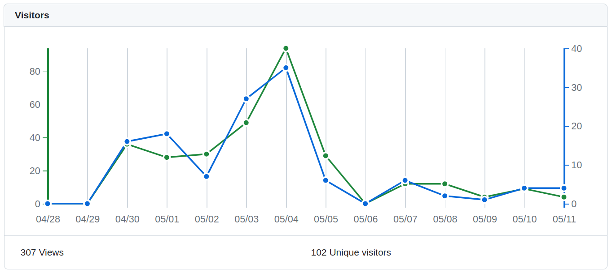

Статистика [репозиториев проекта](https://github.com/orgs/psalru/repositories) на GitHub показывает (см. рисунок ниже), что на создаваемые мной Jupiter Nootebook-и и др. страницы с кодом, трафик приходит только в момент публикации информации о них в [Телеграмм канале](https://t.me/psalchannel) проекта. Поэтому, **вдохновившись работой коллег** из ВШЭ над ресурсом [«Онлайн-руководство по наукометрии»](https://sciguide.hse.ru/) и [сайтом Дмитрия Федорова](https://dfedorov.spb.ru/) с обучающими материалами по Python и Pandas, решил попробовать **расширить аудиторию проекта** за счёт оформления материалов в более 🤗 удобном для целевой аудитории виде и наиболее доступном для индексации 🔍 поисковым системам месте.

<!--truncate-->

Сайт реализован на [Docusaurus](https://docusaurus.io/), который на мой взгляд является удачным решением для оформления **OpenSource документации**. Плюс был опыт работы с ним во ФГАНУ «Социоцентр» в виде оформления [документации для университетов](https://help.sociocenter.info/).

## Основные концепции

Главной точкой приложения силы остаются конкретные решения связанны с **данными про университеты** 🇷🇺 Российской Федерации. Выборкой продолжают быть университеты, участники федеральных программ [«Приоритет 2030»](https://priority2030.ru/) и [«Передовые инженерные школы»](https://engineers2030.ru/). Просто, я **очень надеюсь**, за счёт структурирования информации, должно стать всё немного удобней.

Все **обучающие материлы** я поделил на следующие блоки:

1. **[Парсинг](/docs/category/парсинг)** — описание и сбор данных из публичных источников информации в интернете
1. **[API](/docs/category/api)** — описание и сбор данных из источников, реализованных в виде API
1. **[Инструменты](/docs/category/инструменты)** — раздел посвящён конкретным инструментам и решениям

Дополнительно появился [блог](/blog), в котором вы читаете данный материал, но он скорей для материалов, когда захочется немного пораглагольствовать.

:::success Это OpenSource 

Самое главное, на что хочется **обратить внимание**, что **это OpenSource проект**, в котором Вы можете **легко поучаствовать** оформив соответствующий pull request (можно почитать [тут](https://www.digitalocean.com/community/tutorials/how-to-create-a-pull-request-on-github), как это сделать) к любому из [репозиториев в GitHub](https://github.com/orgs/psalru/repositories).

:::

Приветствуются 👏 обсуждения релевантных тем в [открытой группе в Телеграмм](https://t.me/psalgroup).

P.S. До конца следуя **принципам открытости**, сделал 📊 [статистику в Я.Метрике](https://metrika.yandex.ru/dashboard?id=91769261) **публичной** 👍
