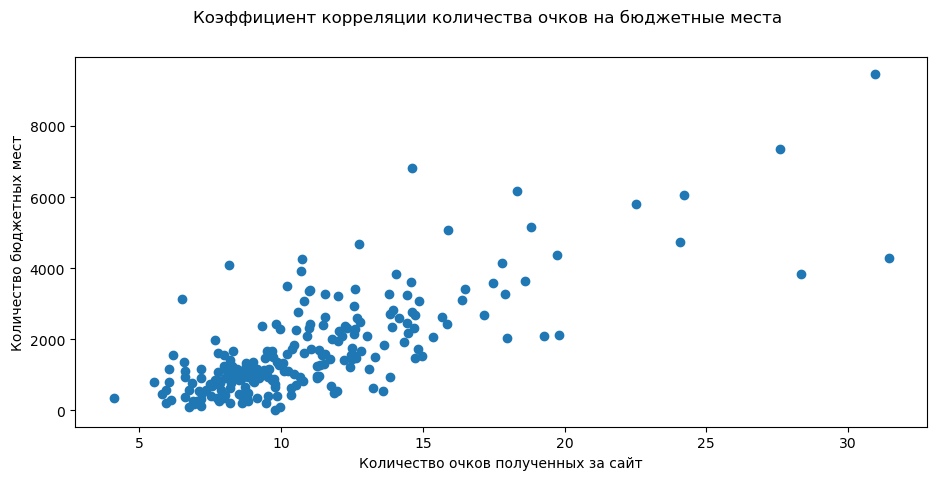

После описания процесса [парсинга сайтов 🏆 рейтингов университетов](/docs/parsing/universities-rankings) и короткой дискуссии в [Телеграмм 💬 группе](https://t.me/psalgroup/13516) на эту тему, действуя по принципу «критикуешь предлагай», захотелось построить «свой рейтинг университетов с бледжеком и прозрачной методологией».

<!--truncate-->

## Что не нравится сейчас

Если взять самые известные рейтинги университетов, как международные, так и сугубо российские, лично мне не понятна их практическая ценность, вернее её отсуствие, в работе университетов. Субъективно кажется, что когда выходит/обновляется очередной рейтинг университеты, наши вузы, естественным образом, просто делятся на 2 категории:

1. «Греются в лучах славы», если они попали или заняли какие-то достойные места, что тоже очень относительно, хвастаясь об этом в СМИ или на своих сайтах;
1. «Обтекают» или просто игнорируют рейтинги как таковые 🤷‍♂️

Весь [«Проект 5-100»](https://ru.wikipedia.org/wiki/%D0%9F%D1%80%D0%BE%D0%B5%D0%BA%D1%82_5-100) был посвящён вхождению наших университетов в ТОП 100 международных рейтингов. Критиковалась сама цель и на старте и вроцессе, что в конечном счёте привело к появлению вполне устоявшегося термина [«рейтингобесие»](https://ya.ru/search/?text=%D1%80%D0%B5%D0%B9%D1%82%D0%B8%D0%BD%D0%B3%D0%BE%D0%B1%D0%B5%D1%81%D0%B8%D0%B5).

Не буду сваливаться в обсуждение всех проблем зарубежных рейтингов университетов, которые с началом СВО только усугубились. Об этом много сказано и написано намного более умными людьми. Лишь зафиксирую своё субъективное мнение, что **рейтинги это максимально упрощённый инструмент, для тех, кто «не в теме»** быстро проранжировать университеты и сформировать короткий список, для дальнейшей работы. Например очевидна **польза для абитуриентов** и их родителей. А вот **практическая ценность** для самих университетов, которая позволяет им формировать список конкретных задач, направленных на развитие, **сомнительна**.

Просится какой-то более **профессиональный инструмент** (кажется, что даже просится термин [«Профессиональные рейтинги университетов»](#профессиональные-рейтинги)), который переодически бы фиксировал текущее положение дел и очевидно подсвечивал пути дальнейшего развития по своей тематике.

## Профессиональные рейтинги

Опираясь на свой профессиональный опыт работы в университетах, наиболее близка мне **проблематика «сайтов университетов»** и в процессе работы я сталкивался с двумя рейтингами, которые в той или иной степени эксплуатировали обозначенную тему:

1. Зарубежный рейтинг [«Web of Universities»](https://www.webometrics.info/)
1. Отечественный [«Рейтинг медийной активности вузов (М-Рейтинг)»](https://xn----ftbfmepluu.xn--p1ai/)

Оба рейтинга хороши, за счёт эксплуации более узкую тематики связанной с университетами, но аналогично «большим рейтигам» страдают минимальной практическо пользой для университетов. Давайте по отдельности разберёмся почему так получается.

### Web of Universities

Позиции в [рейтинге](https://www.webometrics.info/en/Methodology) на момент написания данной страницы (август 2023), формируется из:

* **VISIBILITY 50%** — количество внешних сетей (подсетей), ссылающихся на веб-страницы сайта университета (нормализуется, а затем выбирается среднее значение). Источником данных для расчётов являются 2 сервиса Ahrefs и Majestic (оба сервиса, в той или иной форме, не дают работать с сбой пользователям из 🇷🇺 РФ).
* **TRANSPARENCY (or OPENNESS) 10%** — количество цитирований от ТОП 310 авторов (при этом исключаются ТОП 20 авторов из списка). Источник информации [«Академия Google»](https://scholar.google.com/).
* **EXCELLENCE (or SCHOLAR) 40%** — количество статей, входящих в ТОП 10% наиболее цитируемых по каждой из всех 27 дисциплин полной базы данных. Источник [Scimago](https://www.scimagojr.com/).

Раньше ещё был показатель **«PRESENCE»**, который формировался по данным поиской системы Google. Показатель формировался из количества проиндексированных страниц поисковой системой на доменном имени университета.

Как видно, рейтинг непосредственно связан с web-составляющей университетов только на 50% (когда был актуален показатель «PRESENCE 5%», ситуация была +/- аналогичная)... Но самая главная моя претензия — **web-частью рейтинга очень легко манипулировать** не улучшая не то что университет, а даже его сайт. Достаточно просто **закупиться внешними ссылками на сайт университета**, следя за тем, чтобы IP адреса доноров не пересекались (это не гипотеза, проверено лично в работе). Когда-то на сайте, где-то было уточнение, что не должно быть пересечений в [классе C сетей](https://ru.wikipedia.org/wiki/%D0%9A%D0%BB%D0%B0%D1%81%D1%81%D0%BE%D0%B2%D0%B0%D1%8F_%D0%B0%D0%B4%D1%80%D0%B5%D1%81%D0%B0%D1%86%D0%B8%D1%8F), что немного усложняет задачу, но сейчас я этого не нашёл. Возможно борьба с накрутками, чтобы не всё было так очевидно 🤷‍♂️

Саму возможность манипулиции [подтверждают](https://www.webometrics.info/en/Methodology) сами составители рейтинга:

> During the last years we discovered and fight unethical practices intending to manipulate (improving) the ranks of certain universities. In many cases these bad practices are so serious that **local authorities** should be called, so we decided not to act unilaterally regarding these activities. If you suspect any wrongdoing, please contact with the **university head, local or national authorities and/or journalists**.

На мой взгляд **очень наивная** 🤓 и в практической плоскости бесполезная позиция. Но рейтинг их, он продолжает выходить и даже слегка модифицируется. Пожелаем им удачи 👍

### М-Рейтинг

Рейтинг родившийся в недрах Министерства науки и образования РФ, который «учитывает эффективность работы университетов в медийном пространстве» и сайты университетов являются только 1/3 общего рейтинга. Но тут как есть, аббревиатуру «web» рейтинг не эксплуатирует и ладно, состредоточимся на критики именно этой части рейтинга.

На сайте рейтинга **отсутствует методология рейтинга**, есть только такое:

> **Как улучшить позицию в рейтинге**
>
> Высокое значение M-RATE демонстрируют университеты, которые гармонично развивают собственные медийные команды. Рейтинг составлен таким образом, что небольшие вузы могут конкурировать с крупными федеральными университетами. Ежемесячно показатели вузов анализирует команда аналитиков. Они следят за тем, чтобы в рейтинге не учитывались любого вида аномалии, связанные с механическим набором показателей.

**Практическое значение** данного текста на мой взгляд **стремится к нулю** 🤷‍♂️ Покапавшись в поиске можно найти на сайте министерства [документ за август 2021 г.](https://www.minobrnauki.gov.ru/upload/2021/08/Site%20Index.pdf), где где фигурируют 3 показателя, из которых формируется рейтинг по сайтам:

* **Trafficstd** — совокупный трафик за отчётный месяц
* **Av.Time** — среднее время, которое пользователь проводит на сайте вуза
* **1 — Bounce Rate** — количество отзазов

По самим названиям показателей и поиску можно выйти на сервис [similarweb](https://www.similarweb.com/) и сделать предположение/допущение, что именно он используется как источник данных. Далее мы можем попробовать воспроизвести проблемы, которые возникнут у людей отвечающих за сайт, в практической плоскости, при попытке улучшить позиции в рейтинге:

1. На сколько сторонний ресурс, коим является similarweb относительно сайтов университетов, оценивает корректно все показатели и если я буду ориентироваться на доступную мне объективные цифры [Google Analytics](https://analytics.google.com/) и/или [Яндекс.Метрики](https://metrika.yandex.ru/).
1. Совокупный трафик сайта всегда будет больше у больших университетов, если не выходить за рамки основной аудитории (абитуриенты, студенты и сотрудники университета). А расширять тематику сайта, чтобы нагнать дополнительный трафик, или ещё хуже закупать его или ещё как-то им манипулировать на постоянной основе это антипаттерн.
1. Большой вопрос по отказам. Если верно допущение, что рейтинг использует [данные similarweb](https://support.similarweb.com/hc/en-us/articles/115000501625-Bounce-Rate), он как и [Google считает](https://support.google.com/analytics/answer/1009409?hl=ru) отказом просмотр не более одной страницы, в отличии от Яндекса, который [отслеживает дополнительные параметры](https://yandex.ru/support/metrica/general/glossary.html#glossary__gen).
1. Борьба за увеличение среднего времени на сайте кажется странным, т.к. сайты университов не являются развлекательными ресурсами или СМИ и скорей наоборот должны отвечать на вопросы пользователей максимально быстро 🤔
                
И таких вопросов, без чёткой методолгии рейтинга нагенерировать можно очень много.

Но даже не зная, ничего о методологии, мы можем посмотреть коэффициент корреляции очков полученных за сайт университета, к количеству бюджетных мест, которые есть на сайте самого рейтинга (код собирающий данные см. на [GitHub](https://github.com/psalru/analytics/tree/master/PSAL-22_websites_quality/corr_in_m-rate.py), получившиеся данные в ⬇️ [csv](https://storage.yandexcloud.net/psal.public/datasets/posts/2023-08-28-yet-another-ranking-university-part-1/m-rate_data.csv) и ⬇️ [excel](https://storage.yandexcloud.net/psal.public/datasets/posts/2023-08-28-yet-another-ranking-university-part-1/m-rate_data.xlsx)). Его значение составляет **0,764** и на графике ниже это также хорошо видно, что при остуствии «правил игры» скорей будет демотивировать сотрудников отвечающих за сайт 😔

:::success Бага должна стать фичей

На примере этих двух рейтинов мы видим, что воспроизводится что-то вроде [«эффекта наблюдателя»](https://ru.wikipedia.org/wiki/%D0%AD%D1%84%D1%84%D0%B5%D0%BA%D1%82_%D0%BD%D0%B0%D0%B1%D0%BB%D1%8E%D0%B4%D0%B0%D1%82%D0%B5%D0%BB%D1%8F), которую пытаются «фиксить» странным образом. На мой же взгляд этот **недостаток прекрасен** и должен стать **ключевым преимуществом** в «профессиональных рейтингах университетов», подсказывающим что и как можно сделать лучше.

:::

## Собираем свой рейтинг

Сразу надо определиться для кого рейтинг будет иметь практическое значение — сотрудники университетов и/или их подрядчики, задействованные в работах связанных с сайтами университетов. С некоторым упрощением, далее делим эту группу на сферы отвественности:

1. **Дизайн** — дизайнеры, юзабилити специалисты и др. специалисты, от которых зависит максимально субъективная часть сайта связанная с красотой и удобством.
1. **Разработка** — программисты, верстальщики, администраторы серверов, от которых зависит техническая составляющая сайтов университета.
1. **Интернет маркетинг** — SEO-специалисты, копирайтеры и др. специалисты от которых зависит эффективность охвата целевой аудитории сайта.

Руководству университета рейтинг также будет полезен, как некоторый KPI для довольно дорогостоящей части специалитов (собственные это сотрудники или внешние тут не важно).

Осознанно решено, что рейтинг будет покрывать только две сферы «разработка» и «интернет маркетинг», т.к. **сфера «дизайна» очень субъективна** и лично мне, опираясь на предыдущией опыт работы, не хочется трогать её даже довольно длинной палкой 🙅‍♂️

О метриках для «Разработки» я подробно остановлюсь здесь, а вот «Интернет маркетинг», как отдельную большую тему, разберу в следующей части, после обратной связи на этот пост.

## Пузомерки разработчиков

Сфера сайтов, а скорей даже шире «web-разоботка», возможно одна из немногих областей, где **крайне просто**, при наличии желания, получать какие-то **объективные данные** для самоанализа. Тут [Яндекс.Вебмастер](https://webmaster.yandex.ru/) Вам подскажет что не так, часть данных [Яндекс.Метрика](https://metrka.ya.ru/) и [Google Analytics](https://analytics.google.com/) будет полезна для разработчиков, постоянно мониторинг производительности и ошибок (для примера сервис [Sentry](https://sentry.io/)), вся работа скорей всего ведётся через git и [GitLab](https://about.gitlab.com/), а команды, по идее, должны использовать какой-нибудь трекер задач. Умеряться можно 🤗

Но проблема в том, что это всё относительно легко, когда ты внутри организации и у тебя есть доступ к данным, связанным с разраткой. Не буду останавливаться на описании процесса перебора всех инструментов, которые гипотетически можно применить для ранжирования сайтов университетов. Остановился я на [PageSpeed Insights](https://pagespeed.web.dev/) от Google (очень хотелось что-то от Яндекса, но схожий инстурументарий в [Я.Вебмастере](https://webmaster.yandex.ru/) доступен только владельцам сайтов).

PageSpeed Insights может дать нам информацию по любой странице по ниже представленным категориям, как для компьютеров, так и для мобильных устройст.

* **Производительность** — показатели, которые меряют скорость Вашего сайта для конечного пользователя. Чем быстрее «рендерим» сайт, тем лучше 👍
* **Специальные возможности** — проверки на ряд технических возможностей, а также на сколько они правильно используются на проверяемой web-странице.
* **Рекомендации** — проверяются «лучшие практики» на странице.
* **Поисковая оптимизация** — на сколько корректно используются технические составляющие в этой категории. Тут предвижу недоумение читателей: «SEO-шные штучки вешать на технарей? 😳». Но мой ответ «Да», т.к. именно программисты и верстальщики должны предоставить SEO-шникам весь спектр возможностей, которыми располагает современная web-разработка в этой части (пузомерками результатов работы SEO-шников займёмся в следующих постах). Часть необходимого Ваш код в состоянии генерировать самостоятельно, оставшуюся часть, потребуйте в интерфейсе системы управления сайтом.

Весь спект показателей, которые проверяет сервис проще всего посмотреть на [примере конкретного сайта](https://pagespeed.web.dev/a), а также можно почитать в [документации](https://developers.google.com/speed/docs/insights/v5/about?hl=ru).

Очень важным фактором, почему я остановился на PageSpeed Insights это наличие API, с достаточными для работы лимитами. Приступим к сбору данных.

### Собирать данные

