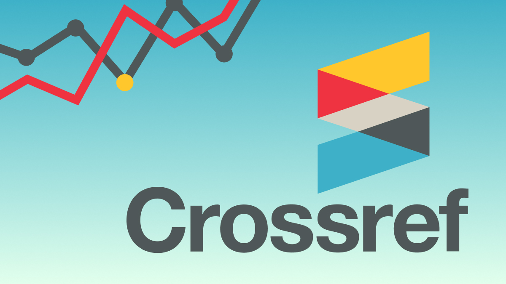
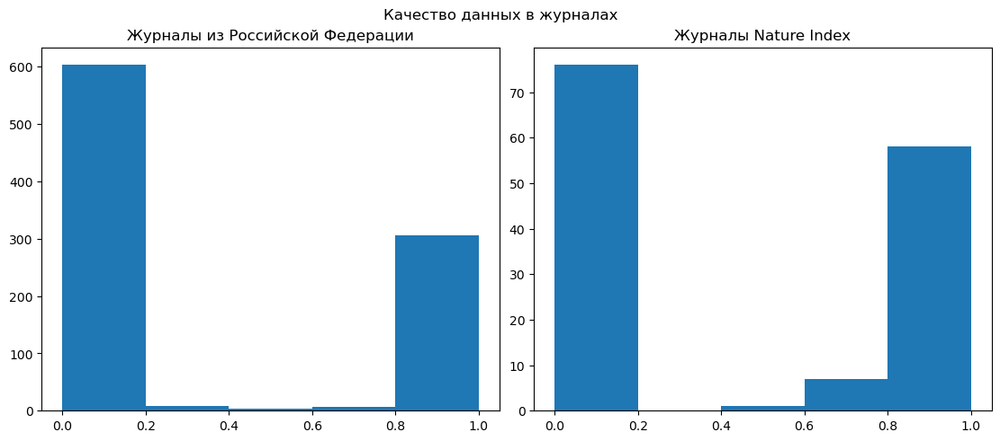

Регулярно после очередного обновления [OpenAlex](https://openalex.org/) 🔥 у нас в команде разгорается надежда на то, что вот сейчас мы сможем **собрать свой собственный SciVal/InCites** и как следует сможем анализировать публикационную деятельность 🇷🇺 Российских организаций на постоянной основе, без всяких там 🤡 Scopus,  🙅‍♂️ WoS и 🫠 РИНЦ.

<!--truncate-->

Последний раз такая попытка была сделан по журналам Nature Index и [университетам, участникам программы «Приоритет 2030»](https://priority2030.ru/analytics/) в конце 2023 года. К сожалению, очередной раз, мы «где залезли, там и слезли». OpenAlex при всей своей технической крутости и открытости данных **продолжает упускать** (именно упускать, поскольку информация об аффилиации отсутствует вовсе, если бы речь шла только о связке, такая задача была бы вполне решаемой) **большую часть аффилиаций** универсиетов (не только 🇷🇺 Российских), т.к. основным источником информации для него являются данные передаваемые издательствами в Crossref.

После этой неудачи очень захотелось, на основании данных, понять ситуацию с журналами, которые связаны непосредственно с 🇷🇺 РФ. Возможно, у наших издательств есть **окно возможностей**, чтобы вовремя скорректировать свою IT-шную составляющую и опередить даже именитых зарубежных коллег в качестве предоставления данных во внешнюю среду.

## Выводы

🇷🇺 Российские и зарубежные журналы в целом **одинаково плохо** относятся к передаче в [Crossref](https://www.crossref.org/) информации, касающейся аффилиаций авторов статей. Даже наиболее авторитетные и отборные академические издания, журналы из списка [Nature Index](https://www.nature.com/nature-index/), содержат пробелы в полях аффилиаций авторов. Одно из самых престижных изданий - Nature (а также все журналы группы, входящие в индекс), при всей технической продвинутости своей платформы, не имеют аффилиаций в Crossref.

Распределение, ожидаемо, **характеризуется выраженной полярностью**, т.е. либо у журнала всё в порядке с соответствующими полями во всех публикациях, либо они отсутствуют везде. Есть редкие исключения, да и те скорее журналы типа Science, где проблемы возникают, вероятно, с публикациями типа новостей и редакторских заметок (это другая проблема Crossref и OpenAlex, очень слабое различение научных статей от других типов публикаций).

Впрочем, на ситуацию можно посмотреть и с другой стороны: целых 256 российских (и много больше зарубежных) журналов **имеют аффилиации в открытом доступе** и при желании уже сейчас на их базе можно создавать аналитические надстройки разной степени разухабистости. Да проблем остается много, от довольно экзотической выборки (по данному критерию, который вычеркивает порой весьма солидные издания), унификации аффилиаций и до вопросов с типами публикаций, но все они решаемы, так или иначе.

**Основной вопрос** - что может сподвигнуть хотя бы 🇷🇺 Российские издания на **более внимательное отношение** к данному аспекту? **Государственные меры** по иерархии в белом списке? Выбор институтов и авторов при прочих равных? Или просто информирование изданий о таких фактах?

Едва ли кто-то откажется от публикации в Nature, потому что аффилиации не передаются в Crossref и не учтутся в чьих-то системах, какой бы статус у этих систем не был (хотя вот, например, Science таким не страдает 😀). Видимо до всеобъемлющего **триумфа открытой науки**, даже в вопросе исключительно аналитической надстройки на уровне организаций над данными публикаций, **еще далеко**. В то же время, приведенные данные могут быть использованы как для исследовательских целей, так и, в определенной мере, при формировании политик отдельных университетов и издательств.

## Алгоритм сбора данных

1. Источником информации по российским журналам стал [«Белый список»](https://journalrank.rcsi.science/ru/record-sources/). Из общей массы источника взяты только журналы из 🇷🇺 России и использующие в качестве агентства регистрации DOI [Crossref](https://www.crossref.org/).
1. Дополнительно, для сравнительного анализа, к выше описанным журналам добавлены журналы из Nature Index (редакция 2023 года).
1. С помощью [API OpenAlex](https://docs.openalex.org/) [скачаны данные](https://github.com/psalru/analytics/blob/master/PSAL-29_check_crossref_data_by_ru_journals/download_openalex_data.py) по статьям за весь 2023 год.
1. С помощью [API Crossref](https://www.crossref.org/documentation/retrieve-metadata/rest-api/) [скачаны данные](https://github.com/psalru/analytics/blob/master/PSAL-29_check_crossref_data_by_ru_journals/download_crossref_data.py), которые научные журналы передали о своих статьях, авторах и их аффилиациях;
1. Далее, для каждой статьи [сформирован показатель качества данных](https://github.com/psalru/analytics/blob/master/PSAL-29_check_crossref_data_by_ru_journals/push_data_on_db.py#L68) —  отношение количества авторов фигурирующих в передаваемых журналом данных в Crossref к количеству авторов у которых указана аффилиация (хотя бы одна).

Описанные этапы и др. связанный код на Python вы можете изучить [в репозитории на GitHub-е](https://github.com/psalru/analytics/tree/master/PSAL-29_check_crossref_data_by_ru_journals).

## Оформление результатов

Результат логичным образом оформился в виде 📊 [Dashboard-а в Datalens](https://datalens.yandex/67me3q7f16tsu), который, надеемся, позволит Вам также сделать сравнительный анализ журналов и статей из выборки.

Также обратите внимание, что все **данные по каждой статье доступны для скачивания** и перепроверки. Сводную таблицу в формате csv можно скачать по ⬇️ [данной ссылке](https://storage.yandexcloud.net/psal.public/datasets/tasks/PSAL-29/check_results.csv).
