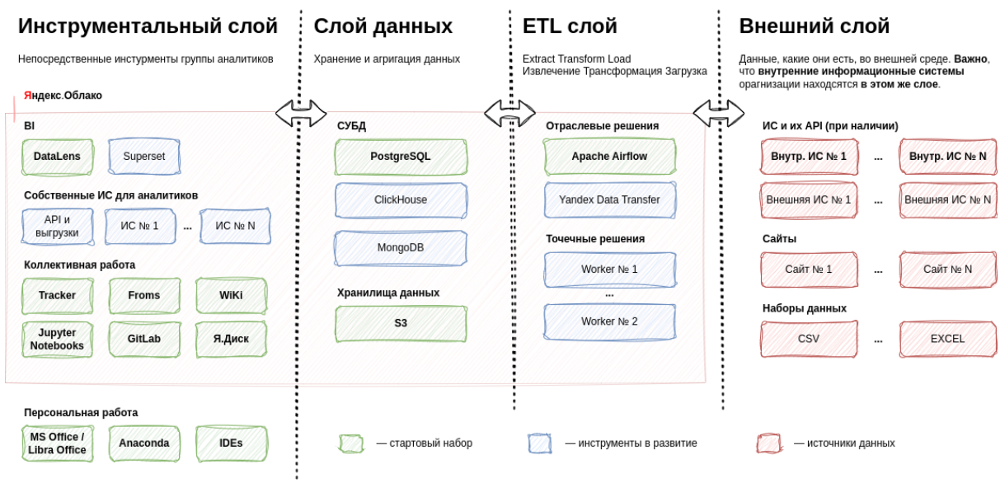

В 1974 г. в популярном издании «Литературная газета» открылась новая рублика: «Если бы директором был я…», ставшая очень популярной и имевшая много подражаний. В рублике публиковались предложения читателей по управлению народным хозяйством страны. Отдельные идеи читателей газеты, как ни странно, воплощались в жизнь. Оттолкнувшись от старого опыта, адаптировав его к университетской среде, текущим видением и принципами организации аналитических отделов внутри университетов, которые, по идее, являются важным «инструментарием» Ректоров. Наименование и точные функции подразделения естественно могут варьироваться, возможно может быть частью 💼 «Проектного офиса университета», которые выросли, «как грибы после дождя», в рамках федеральных программ развития университетов, таких как [«Приоритет 2030»](https://priority2030.ru/) и/или [«Передовые инженерные школы»](https://engineers2030.ru/). В данном материале я сконцентрируюсь на принципе с красивым, устоявшимся названием — **«Управление на основе данных»**, большую часть жизненного цикла которого, как раз и должно реализовывать упомянутое выше подразделение.

<!--truncate-->

:::caution Важно понимать

Данный материал — это не результат научного исследования ИТ-инфраструктур университетов и инструментов, которые используют в данный момент вузы для аналитики своей деятельности. Всё, ниже написанное, базируется на субъективном опыте конкретного человека более 10 лет связанного с ИТ в университетской среде, а последние несколько лет напрямую с анализом данных.

:::

По этим же причинам, осознанно фокус делается на конкретне, пропущенных через себя и/или кажущиеся перспективными, инструменты, которые позволят **создать точки роста** в университете на основе данных.

## Текущее положение дел

Сам запрос на объективную картину в цифрах и графиках, для дальнейшего принятия оптимальных решений у Ректоров реально присутствует. Об этом свидетельствует сами программы развития университетов (для тех, кто «не в теме», примеры можно изучить [здесь](https://priority2030.ru/analytics/), перейдя на страницу конкретных университетов, а далее в подраздел «Программа развития»), через которые красной нитью проходит «цифровизация» и «управление на основе данных».

### Срочно нужны данные

Чтобы «подсветить» имеющиеся проблемы, представим, что Ректору приходит **срочный запрос** от Министерства науки и высшего образования 🇷🇺 РФ о необходимости предоставить информацию о большинстве направлений деятельности университета, или, того хуже, нужно подготовить, обоснованные объективными данными, материалы для подачи на какой-то новый конкурс или отчитаться по текущему.

Описанная ситуация, с большой степенью вероятности, покажет следующее:

1. В университете **нет единого отдела**, обладающего непосредственно (подзапрос в др. подразделения не в счёт) **всей полнотой данных** или даже большей их частью, чтобы отработать такой запрос, спущенный от Ректора.
1. Децентрализация данных по направлениям (обычно эта часть персонализируется и отдаётся проректорами по направлениям), усугубляется крайне **неоднородным ИТ-ландшафтом университета** — 🐒 «зоопарк» информационных систем решающий конкретные задачи подразделений, в редких случаях, обменивающихся данными.
1. **Рассинхронизация в понимании данных** (методология и возможности), которыми обладает университет. Почти наверняка, представление руководства университета об аккумулируемых данных внутри университета, сильно отличаются от реальных возможностей. Может выясниться, что данных нет или, запрашивается только часть имеющихся данных, которые не в полной мере характеризует направление деятельности.
1. Описанное в первых трёх пунктах легко может **привести к ошибкам**, и, более того, даёт возможность к существенным **манипуляциям данными**.
1. Наконец **окончательная сборка** предоставленных данных — крайне **сложный процесс**, особенно если в конце получается нечто неприглядное и нужно уходить на новый круг для получения дополнительной информации.

Отдельно нужно **обратить внимание**, что есть высокая вероятность, запустив этот процесс ещё раз, через довольно короткий промежуток времени можно получить данные отличающиеся от тех, что были получены до этого. Реальный пример — противоречия в данных отчётов «Приоритет 2030» за 2022 г. и данных подаваемых ранее в рамках «1-мониторинг».

А мне, как Ректору, хотелось бы видеть все эти данные в онлайн режиме, а не разово по «особым случаем». Отсюда естественным образом вытекает стандартное решение, которым пробуют решить хотя бы часть проблем 💁‍♂

## +1 информационная система

На уровне ректората «очевидным» решением обычно становится запуск процесса внедрения новой информационной системы, которая «решит все проблемы». Подкрепляет уверенность в успешности такой идеи обычно следующее:

1. Готовые решения и красивые картинки — даже с учётом не сильно большого рынка, существует некоторое количество предложений в этой области. Презентации красивые, положительная обратная связь от уже внедривших и т.д.
1. Самописные решения и амбиции внутренних ИТ-шников — есть вероятность, что внутри вуза, понимая проблематику конкретного университете намного лучше, готовое решение забракуют и примут решение «пилить своё».

В самом процессе разработки и внедрения новой информационной системы я не сомневаюсь. Она будет сделана и запущена (после этого, обычно второй пункт в списке выше, становится первым). Но уже в процессе реализации проекта начнёт появляться понимание, что для успешности результата потребуется:

1. **Интеграция с существующими информационными системами.** Реализовать стабильный забор данных из существующих информационных систем на постоянной основе, которые тоже являются «живыми организмами», обычно существенно усложняет их функционирование. Или ещё более сложное решение — организовать внутри университета «шину данных», через которую будут общаться все информационные системы.
1. **Добрать внутренние данные.** Если первый пункт не получается или информационной системы просто нет, то будет создаваться функционал внутри новой информационной системы и генерировать дополнительную нагрузку на сотрудников университета, направленную на поддержание данных в актуальном состоянии (с высокой вероятностью это будет приводить к двойной работе, в нескольких информационных системах).
1. **Интеграция с внешними источниками данных.** Скорей всего, дополнительно, потребуется интеграция с внешними источниками данных.

По моему личному опыту, чем больше университет, чем больше затрагивается направлений деятельности, тем сложнее и медленней протекают процессы внедрения нового. Если данный тезис вызывает сомнение, рекомендуют пробежаться по сайтам университетов (просто информационным сайтам, где только текст, фотографии и видео) и почти всегда вы увидите, что основные виды деятельности рассредоточены по поддоменам, имеют (относительно друг друга) разный дизайн, навигацию, часто применяются разные технические и концептуальные решения. Уровень атомарности информационных сайтов варьируются конечно от университета к университету, но этот феномен точно присутствует и легко наблюдается.

Особо **обратите внимание**, что в процессе непосредственной разработки новой ИС аналитический отдел может быть вообще никак не задействован, он будет просто очередным пользователем информационной системы и будет пользоваться ровно тем, на что хватит ресурса (денег или рабочего времени программистов внутри университета).

Я же как Ректор, имею риск получить формально запущенную информационную систему, которая в полной мере не решает моих задач и генерирует дополнительную работу и негатив моих сотрудников, а ещё она скорей всего жутко дорого обходится.

## Аналитический отдел мечты

В идеале, руководству университета, как хорошему исследователю, необходимо наблюдать объект, фиксировать и интерпретировать данные о нём. При этом, фактом своего наблюдения не нарушать и не усложнять текущую работу организации.

Концептуально, выше описанное можно представить в виде схемы, элементы которой будут подробно объяснены далее по тексту.

### Основные элементы

До начала описания набора технических решений, с помощью которых предлагается решать поставленные задачи, важно понимать, что основным элементом успеха станут сотрудники аналитического отдела, обеспечивающие жизнеспособность представленной схемы. Разделим их по сферам ответственности и обозначим основные компетенции и обязанности:

1. **Руководство аналитического отдела** — связующее звено между Ректором и сотрудниками аналитического отдела. Очень важно, чтобы этим людям были делегированы все необходимые права для работы с данными, а непосредственно руководители готовы были принять на себя последствия, вытекающие из этого. Без хорошего, желательно разностороннего опыта работы в университетах тут, на мой не обойтись.
1. **Аналитики** — обладают контекстом «университетской жизни» и умеют непосредственно работать с данными (Python, Pandas, SQL, Excel, BI). Если какой-то из составляющих не хватает, надо добирать (контекст придёт с опытом, навыки развивать самостоятельно или с помощью курсов).
1. **Инженеры данных** — в основном обладатели технических компетенций (DevOps, Python, организация [ETL процессов](https://ru.wikipedia.org/wiki/ETL), администрирование баз данных и мн. др.), контекст приветствуется, но далеко не обязателен, его отсутствие быстро добирается в общении с аналитиками и руководством.

Выше описанные компетенции, вполне себе востребованы рынком и вне сферы высшего образования. И надо быть готовым, что, аналогично программистам, которые также «легки на подъём», необходимо будет поддерживать соответствующие условия труда.

Развивая тему условий труда, следует обращать внимание не только на заработную плату и помещения/рабочие места. Техническим специалистам очень важно — в рамках какой экосистемы они работают. Насколько быстро и просто они могут получить вычислительные ресурсы и мощности, в необходимых для работы объёмах. Рекомендую смотреть в сторону облачных решений. Возможны бухгалтерские или ещё какие-то бюрократические сложности, но все они преодолеваются, если есть воля к этому (всегда можно поинтересоваться [опытом коллег](https://cloud.yandex.ru/solutions/education)).

#### Внешний слой

Концепции, заложенные в этом слое, являются прямой противоположностью ситуации, которая может возникнуть (описана выше), при внедрении новой информационной системы. Все потенциальные источники данных воспринимаются как внешние и работа ведётся «по их правилам». Единственное, что требуется — забрать данные «как есть», не нарушив при этом работу источника данных (более подробнее про механики см. в описании Apache Airflow).

Могло показаться, что я выступаю против внедрения новых информационных систем. Это не так, чем больше будет удобных интерфейсов, в которых пользователи университета смогут решать свои задачи, тем лучше. Но когда внедрение или модернизация спровоцированы не задачами и потребностями пользователей, а чем-то другим — велика вероятность получить отрицательный результат.

#### ETL слой

На этом слое происходит вся «магия» аккуратной работы с потенциальными источниками данных. Обеспечивается она следующими инструментами:

* [Apache Airflow](https://airflow.apache.org/) — система для создания, выполнения, мониторинга и оркестрации потоков операций по обработке данных. Стандартный [набор операторов](https://airflow.apache.org/docs/apache-airflow/stable/core-concepts/operators.html) и [поддержка работы со сторонними решениями](https://airflow.apache.org/docs/#providers-packagesdocsapache-airflow-providersindexhtml) позволяет подключиться и работать с данными практически из любого источника.

На старте очень многое можно будет решать Apache Airflow, но в развитие или просто как альтернатива для конкретных задач присутствуют другие решения. Например, [Yandex Data Transfer](https://cloud.yandex.ru/services/data-transfer) и [Cloud Function](https://cloud.yandex.ru/services/functions) если Вам захочется больше облачных решений или [Apache NiFi](https://nifi.apache.org/) для более сложных сценариев по работе с данными.

#### Слой данных

Стартовать лучше всего с классических и наиболее понятных команде решений, но по мере роста задач и данных, стоит обращать внимание и на дополнительные возможности и альтернативы, которые у Вас есть.

* [PostgreSQL](https://cloud.yandex.ru/services/managed-postgresql) — хорошее, классическое решение для организации реляционной базы данных, на базе которой можно организовать ядро Ваших данных.
* [S3 (Object Storage)](https://cloud.yandex.ru/services/storage) — облачное объектное хранилище, которое изменит Ваше представление о простоте хранение файлов, если Вы ещё не пользуетесь им.
* [MongoDB](https://cloud.yandex.ru/services/managed-mongodb) — документоориентированная система управления базами данных. Например, очень хорошо подходит для хранения большого объема данных из внешних источников о публикациях, аффилированных с университетом.
* [ClickHouse](https://cloud.yandex.ru/services/managed-clickhouse) — столбчатая СУБД, ориентированная на аналитические задачи.

#### Инструментальный слой

Данный слой сильно вариативен и в нём сосредоточено наибольшее число инструментов:

* BI инструменты — рекомендую начать с облачного решения [DataLens](https://cloud.yandex.ru/services/datalens) (во всех смыслах стартовать будет проще), но при необходимости и наличии соответствующих навыков можно развернуть и использовать [Superset](https://superset.apache.org/) или [Grafana](https://grafana.com/).
* Коллективная работа:
    * [Яндекс.Трекер](https://cloud.yandex.ru/services/tracker) — этот инструмент позволит отделу организовать коллективную работу над аналитическими задачами. Дополнительным, не всегда очевидным, преимуществом будет накапливание ретроспективных знаний на тему Вашей аналитической инфраструктуры. При правильном ведении задач (по началу это требует самоорганизации и дополнительных усилий, но довольно быстро это станет естественным процессом внутри команды), всегда можно ретроспективно разобраться почему было сделано именно так, а не иначе.
    * [WiKi](https://cloud.yandex.com/en/services/wiki) — всё что связано с аналитикой всегда подразумевает фиксацию ключевых моментов и методологий. Ведение ключевых моментов это дополнительная и обычно не очень приятная работа, но, если мы хотим максимально сохранять знания внутри университета и быстро настраивать контекст новых сотрудников, не игнорируйте этот или похожие инструменты, которые для этого созданы.
    * Jupyter Notebooks — уже ставший классическим инструмент для аналитиков. В рамках Яндекс.Облака это называется [«DataSphere»](https://cloud.yandex.ru/services/datasphere), который существенно расширяет стандартные возможности.
    * [GitLab](https://cloud.yandex.ru/services/managed-gitlab) / [GitFlic](https://gitflic.ru/) — система управления Git-репозиториями (без истории изменения кода, с привязкой к конкретным задачам в Я.Трекере, полностью теряется прозрачность кодовой базы). В процессе развития скорей всего Вы начнёте изучать дополнительные возможности CI/CD.
    * [Forms](https://cloud.yandex.ru/services/forms) — вариантов использования много, но в контексте аналитических задач самым очевидным является организация социологических исследований разных аудиторий университета.
    * [Я.Диск](https://360.yandex.ru/disk/) — для обмена и хранения файлами, которые по каким-то причинам вы не хотите хранить в S3 (Object Storage). На всякий случай надо оговориться, что Я.Диск не часть Я.Облака, а часть Я.360 (могут быть нюансы с оплатой корпоративных аккаунтов).
* Собственные ИС для аналитиков — существует вероятность, что захочется иметь собственные интерфейсы (API или даже в виде UI) внутри аналитического отдела, для оптимизации каких-то процессов работы с данными. В этом случае обратите внимание на [Jango](https://www.djangoproject.com/) и [Django REST Framework](https://www.django-rest-framework.org/).
* Персональная работа:
    * [LibreOffice](https://www.libreoffice.org/) — привычней обычно MS Office и его Excel, но времена меняются, а [Calc](https://www.libreoffice.org/discover/calc/) в базе как минимум ничем не хуже, а для чисто технических специалистов имеет ряд преимуществ (работа с csv).
    * [Anaconda](https://www.anaconda.com/) — это некий «швейцарский нож» для аналитиков, с очень большим набором популярного инструментария из этой области.
    * IDEs — лично я предпочитаю DataSpell от JetBrains (в данный момент выпилились из 🇷🇺 РФ, но академическую лицензию ещё получить можно), но выбор очень велик, каждый найдёт подходящее для себя решение.

При выборе и инструментария рекомендую опираться не только на субъективное мнение технических специалистов, а ещё проверять на сколько инструмент востребован рынком. Я люблю для этого использовать HeadHunter, просто вбивая технологию в строку поиска и оценивая количество вакансий и их релевантность по моим задачам в описании (пример запроса по [Apache Airflow](https://hh.ru/search/vacancy?text=aiflow&area=2)).

Самое главное для меня, как Ректора, при внедрении описанной конфигурации и административной поддержки с моей стороны, я имею право ожидать **быстрых результатов**. Не надо ждать завершения большого цикла разработки и наполнения информационной системы данными. Всё сводится к следующему:

1. Формулировка задачи и выбор источников данных;
1. Реализация ETL процессов для постоянного сбора данных;
1. Оформление результатов в виде Dashboard-а в BI инструменте или наработка кодовой базы для генерации воспроизводимых отчётов на постоянной основе.

Отдел скорей начинает работать по Agile принципам, выдавая результаты в процессе и корректируя/усовершенствуя их в случае необходимости. Не ждёт чего-то, «решающего все проблемы», что когда-то должен для них кто-то разработать.

Ещё немаловажным фактором, который может существенно повлиять на выбор облачного решения, это возможность попробовать, на достаточно большом промежутке времени, всё бесплатно (Яндекс.Облако предоставляет гранты на старте), а далее пользоваться ресурсами с [существенной скидкой](https://cloud.yandex.ru/edu-offer-20/terms).

## Новые возможности

Если отдел аналитики начнёт показывать стабильный результат, я бы задумался ещё о нескольких направлениях его развития:

1. **OpenSource проекты** под брендом университета — этого очень не хватает, особенно в сфере аналитических решений про университеты. Пробуйте делиться своими наработками в таком формате.
1. Аналитический отдел может **помогать Вашей науке** — иногда складывается парадоксальная ситуация, что в университетах есть люди, которые могут проводить исследования на базе собранного массива данных и писать научные статьи об их результатах. Но все научные коллективы не могут позволить себе держать для этого отдельного дата инженера или аналитика.
1. Выходите на **региональный** и/или **отраслевой уровень** — при хорошо налаженных процессах, связанных с анализом данными, логичным развитием становится выход на региональный и/или отраслевой уровень. Университет логично может претендовать на «мозговой центр» в близких к нему отраслях.
