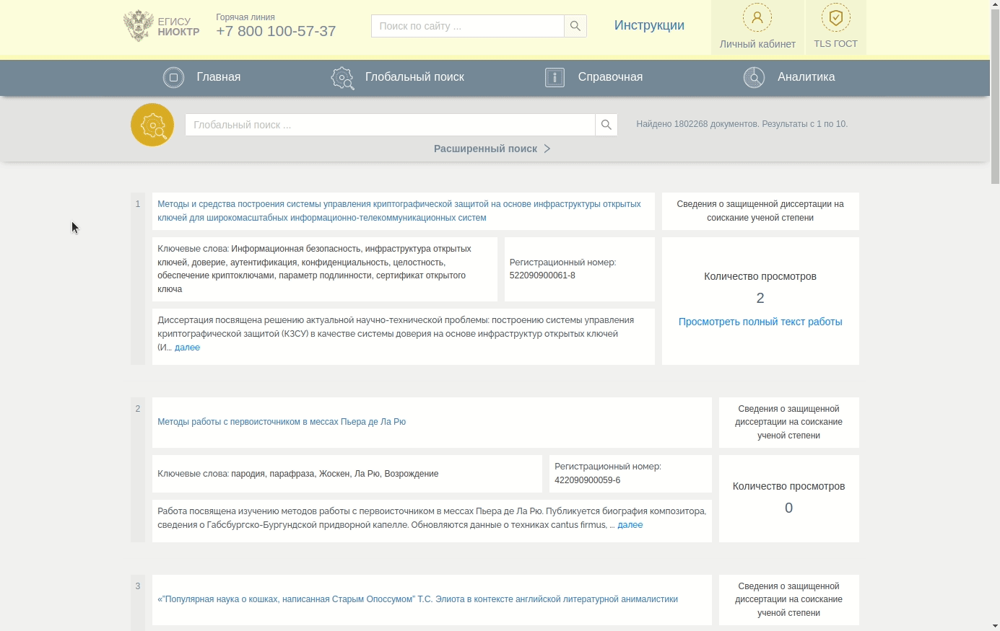

# НИОКТР, РИД и диссертации

Основная задача данного документа продемонстрировать каким образом можно позаимствовать данные по своему университету из публичной части информационной системы (сайта) [ЕГИСУ НИОКТР](https://rosrid.ru/).

Все механики будут показаны на примере одного университета — [Дальневосточный федеральный университет](https://t.me/psalgroup/10182).

Каждый университет в рамках ЕГИСУ НИОКТР **имеет уникальный ID**, по которому и будет осуществляться поиск. На gif-ке ниже показано, каким образом можно узнать ID своего университета (все происходит на странице [«Глобального поиска»](https://rosrid.ru/global-search)).



Зафиксируем данный параметр для ДВФУ, а также заведём переменные, которые ограничат нас текущим годом для поиска.


```python showLineNumbers title="Основные параметры поиска"
uid = '9944117'
start_date = '2022-01-01'
end_date = '2022-12-31'
```

Сначала воспроизведём основное, что нам понадобится в работе.


```python showLineNumbers title="Необходимое для работы"
import requests

# URL API, который осуществляет поиск по ИС
search_url = 'https://rosrid.ru/api/base/search'
# Формируем заготовку для основного тела поиска
payload = {
    "search_query": None,
    "critical_technologies": [],
    "dissertations": False,
    "full_text_available": False,
    "ikrbses": False,
    "nioktrs": False,
    "organization": [uid],
    "page": 1,
    "priority_directions": [],
    "rids": False,
    "rubrics": [],
    "search_area": "Во всех полях",
    "sort_by": "Дата регистрации",
    "open_license": False,
    "free_licenses": False,
    "expert_estimation_exist": False,
    "start_date": start_date,
    "end_date": end_date
}

# Создаём сессию и проставляем стандартные заголовки, что бы не сильно отличаться от браузера
session = requests.session()
session.headers.update({
    'authority': 'rosrid.ru',
    'pragma': 'no-cache',
    'cache-control': 'no-cache',
    'sec-ch-ua': '" Not A;Brand";v="99", "Chromium";v="98", "Google Chrome";v="98"',
    'accept': 'application/json, text/plain, */*',
    'sec-ch-ua-mobile': '?0',
    'content-type': 'application/json;charset=UTF-8',
    'user-agent': 'Mozilla/5.0 (X11; Linux x86_64) AppleWebKit/537.36 (KHTML, like Gecko) Chrome/98.0.4758.80 Safari/537.36',
    'sec-ch-ua-platform': '"Linux"',
    'origin': 'https://rosrid.ru',
    'sec-fetch-site': 'same-origin',
    'sec-fetch-mode': 'cors',
    'sec-fetch-dest': 'empty',
    'referer': 'https://rosrid.ru/global-search',
    'accept-language': 'ru,en-US;q=0.9,en;q=0.8,ru-RU;q=0.7'
})

# Для проверки подключаемся к странице поиска и возвращаем код ответа (должен быть 200)
home_resp = session.request('GET', 'https://rosrid.ru/global-search')
home_resp.status_code
```


    200


Все результаты поиска выдаются информационной системой в **постраничном виде**. Реализуем функцию, которая позволит нам рекурсивно собрать весь объём необходимых нам данных.


```python showLineNumbers title="Постраничный обход результатов поиска"
import time
import json

def get_search_results(data, timeout=1):
    items_in_page = 10
    search_results = []

    try:
        resp = session.request("POST", search_url, data=json.dumps(data, ensure_ascii=False).encode('utf-8'))

        if resp.status_code == 200:
            json_resp = resp.json()
            page = data['page']
            total = json_resp['hits']['total']['value']
            count_of_pages = (int(total / items_in_page) + 1) if total % items_in_page else total / items_in_page

            print(f"Downloaded data from page {page} of {count_of_pages}")

            if page < count_of_pages:
                time.sleep(timeout)
                search_results += json_resp['hits']['hits'] + get_search_results({**data, 'page': page + 1}, timeout)
            else:
                search_results += json_resp['hits']['hits']
    except BaseException as e:
        print('Retry connection', str(e))
        search_results = get_search_results({**data, 'page': 1}, timeout)

    return search_results
```

## НИОКТР

Для начала заберём данные о НИОКТР-ах ДВФУ за 2022 год и посмотрим 5 первых записей.


```python
import pandas as pd

pd.set_option('display.max_columns', None)

nioktrs = pd.json_normalize(get_search_results({**payload, 'nioktrs': True}))
nioktrs.dropna(axis=1).head(5)
```

    Downloaded data from page 1 of 2
    Downloaded data from page 2 of 2


<div>
<table class="dataframe">
  <thead>
    <tr>
      <th></th>
      <th>_index</th>
      <th>_type</th>
      <th>_id</th>
      <th>_score</th>
      <th>sort</th>
      <th>_source.name</th>
      <th>_source.annotation</th>
      <th>_source.keyword_list</th>
      <th>_source.work_supervisor.name</th>
      <th>_source.work_supervisor.surname</th>
      <th>_source.work_supervisor.patronymic</th>
      <th>_source.work_supervisor.position</th>
      <th>_source.organization_supervisor.name</th>
      <th>_source.organization_supervisor.surname</th>
      <th>_source.organization_supervisor.patronymic</th>
      <th>_source.organization_supervisor.position</th>
      <th>_source.executor.id</th>
      <th>_source.executor.organization_id</th>
      <th>_source.executor.name</th>
      <th>_source.executor.short_name</th>
      <th>_source.executor.ogrn</th>
      <th>_source.executor.region.name</th>
      <th>_source.executor.region.code</th>
      <th>_source.executor.okogu.name</th>
      <th>_source.coexecutors</th>
      <th>_source.customer.id</th>
      <th>_source.customer.organization_id</th>
      <th>_source.customer.name</th>
      <th>_source.customer.short_name</th>
      <th>_source.customer.ogrn</th>
      <th>_source.nioktr_bases.name</th>
      <th>_source.nioktr_types</th>
      <th>_source.priority_directions</th>
      <th>_source.critical_technologies</th>
      <th>_source.budgets</th>
      <th>_source.rubrics</th>
      <th>_source.oecds</th>
      <th>_source.last_status.created_date</th>
      <th>_source.last_status.registration_number</th>
      <th>_source.number_of_related_rid</th>
      <th>_source.start_date</th>
      <th>_source.end_date</th>
      <th>_source.contract_number</th>
      <th>_source.contract_date</th>
      <th>_source.reports_number</th>
      <th>_source.udk</th>
      <th>_source.number_of_views</th>
    </tr>
  </thead>
  <tbody>
    <tr>
      <th>0</th>
      <td>nioktrs</td>
      <td>_doc</td>
      <td>ZJP5EE4LCTKBP7PH060ZJJWR</td>
      <td>0.0</td>
      <td>&#91;1661411639597, 0.0&#93;</td>
      <td>Специализированные пищевые системы для профила...</td>
      <td>На основании полученных результатов будут спро...</td>
      <td>&#91;&#123;'name': 'восприятие потребителей'&#125;, &#123;'name':...</td>
      <td>Антон</td>
      <td>Табакаев</td>
      <td>Вадимович</td>
      <td>Доцент Департамента пищевых наук и технологий ...</td>
      <td>Александр</td>
      <td>Самардак</td>
      <td>Сергеевич</td>
      <td>Проректор по научной работе</td>
      <td>JXDYN5VUB7LATD8HZ4740PRS</td>
      <td>2e11cd14ccfce8a78646e73</td>
      <td>ФЕДЕРАЛЬНОЕ ГОСУДАРСТВЕННОЕ АВТОНОМНОЕ ОБРАЗОВ...</td>
      <td>ФГАОУ ВО "ДАЛЬНЕВОСТОЧНЫЙ ФЕДЕРАЛЬНЫЙ УНИВЕРСИ...</td>
      <td>1022501297785</td>
      <td>Приморский край</td>
      <td>25</td>
      <td>Министерство науки и высшего образования Росси...</td>
      <td>&#91;&#93;</td>
      <td>107775997263010000000001</td>
      <td>1e88d205da93af783d0d9da</td>
      <td>Российский научный фонд</td>
      <td>РНФ</td>
      <td>1137799022261</td>
      <td>Грант</td>
      <td>&#91;&#123;'name': 'Фундаментальное исследование'&#125;&#93;</td>
      <td>&#91;&#123;'name': 'Рациональное природопользование'&#125;&#93;</td>
      <td>&#91;&#123;'name': 'Биомедицинские и ветеринарные техно...</td>
      <td>&#91;&#123;'budget_type': &#123;'name': 'Средства фондов под...</td>
      <td>&#91;&#123;'name': 'Отходы производства и их переработк...</td>
      <td>&#91;&#123;'name': 'NUTRITION &amp; DIETETICS', 'code': '03...</td>
      <td>2022-08-25T07:13:59.597600+00:00</td>
      <td>122082500021-5</td>
      <td>0</td>
      <td>2022-07-27</td>
      <td>2024-06-30</td>
      <td>22-76-00008</td>
      <td>2022-07-27</td>
      <td>2</td>
      <td>664:502.171;664:658.567</td>
      <td>0</td>
    </tr>
    <tr>
      <th>1</th>
      <td>nioktrs</td>
      <td>_doc</td>
      <td>ZG7FZFSFZ5JU6Q1PLVWMVGXB</td>
      <td>0.0</td>
      <td>&#91;1661411399139, 0.0&#93;</td>
      <td>Системы на основе биополимеров для доставки ле...</td>
      <td>Большинство препаратов, разрабатываемых для те...</td>
      <td>&#91;&#123;'name': 'наночастицы'&#125;, &#123;'name': 'биополимер...</td>
      <td>Владимир</td>
      <td>Силантьев</td>
      <td>Евгеньевич</td>
      <td>Заведующий кафедрой</td>
      <td>Александр</td>
      <td>Самардак</td>
      <td>Сергеевич</td>
      <td>Проректор по научной работе</td>
      <td>JXDYN5VUB7LATD8HZ4740PRS</td>
      <td>2e11cd14ccfce8a78646e73</td>
      <td>ФЕДЕРАЛЬНОЕ ГОСУДАРСТВЕННОЕ АВТОНОМНОЕ ОБРАЗОВ...</td>
      <td>ФГАОУ ВО "ДАЛЬНЕВОСТОЧНЫЙ ФЕДЕРАЛЬНЫЙ УНИВЕРСИ...</td>
      <td>1022501297785</td>
      <td>Приморский край</td>
      <td>25</td>
      <td>Министерство науки и высшего образования Росси...</td>
      <td>&#91;&#93;</td>
      <td>107775997263010000000001</td>
      <td>1e88d205da93af783d0d9da</td>
      <td>Российский научный фонд</td>
      <td>РНФ</td>
      <td>1137799022261</td>
      <td>Грант</td>
      <td>&#91;&#123;'name': 'Фундаментальное исследование'&#125;&#93;</td>
      <td>&#91;&#123;'name': 'Индустрия наносистем'&#125;&#93;</td>
      <td>&#91;&#123;'name': 'Технологии получения и обработки ко...</td>
      <td>&#91;&#123;'budget_type': &#123;'name': 'Средства фондов под...</td>
      <td>&#91;&#123;'name': 'Структура и функции биополимеров', ...</td>
      <td>&#91;&#123;'name': 'NANOSCIENCE &amp; NANOTECHNOLOGY', 'cod...</td>
      <td>2022-08-25T07:09:59.139698+00:00</td>
      <td>122082500018-5</td>
      <td>0</td>
      <td>2022-07-29</td>
      <td>2025-06-30</td>
      <td>22-73-10172</td>
      <td>2022-07-29</td>
      <td>3</td>
      <td>577.1 577.15</td>
      <td>1</td>
    </tr>
    <tr>
      <th>2</th>
      <td>nioktrs</td>
      <td>_doc</td>
      <td>C6ULS4ADTHJQ83675ME8CWEI</td>
      <td>0.0</td>
      <td>&#91;1660896626635, 0.0&#93;</td>
      <td>Исследование природных и антропогенных воздейс...</td>
      <td>Цель научного исследования – Оценка природных ...</td>
      <td>&#91;&#123;'name': 'природные воздействия'&#125;, &#123;'name': '...</td>
      <td>Кирилл</td>
      <td>Винников</td>
      <td>Андреевич</td>
      <td>Директор Института Мирового океана (школы), за...</td>
      <td>Александр</td>
      <td>Самардак</td>
      <td>Сергеевич</td>
      <td>Проректор по научной работе</td>
      <td>JXDYN5VUB7LATD8HZ4740PRS</td>
      <td>2e11cd14ccfce8a78646e73</td>
      <td>ФЕДЕРАЛЬНОЕ ГОСУДАРСТВЕННОЕ АВТОНОМНОЕ ОБРАЗОВ...</td>
      <td>ФГАОУ ВО "ДАЛЬНЕВОСТОЧНЫЙ ФЕДЕРАЛЬНЫЙ УНИВЕРСИ...</td>
      <td>1022501297785</td>
      <td>Приморский край</td>
      <td>25</td>
      <td>Министерство науки и высшего образования Росси...</td>
      <td>&#91;&#93;</td>
      <td>089Y0A0LoDLV15JGaQ2cLb00</td>
      <td>5f7f75ebf4703b53b50b78d</td>
      <td>МИНИСТЕРСТВО НАУКИ И ВЫСШЕГО ОБРАЗОВАНИЯ РОССИ...</td>
      <td>МИНОБРНАУКИ РОССИИ</td>
      <td>1187746579690</td>
      <td>Государственное задание</td>
      <td>&#91;&#123;'name': 'Фундаментальное исследование'&#125;&#93;</td>
      <td>&#91;&#123;'name': 'Рациональное природопользование'&#125;&#93;</td>
      <td>&#91;&#123;'name': 'Технологии мониторинга и прогнозиро...</td>
      <td>&#91;&#123;'budget_type': &#123;'name': 'Средства федерально...</td>
      <td>&#91;&#123;'name': 'Экологическая токсикология', 'code'...</td>
      <td>&#91;&#123;'name': 'ECOLOGY', 'code': '01.06.GU'&#125;&#93;</td>
      <td>2022-08-19T08:10:26.635601+00:00</td>
      <td>122081900027-6</td>
      <td>0</td>
      <td>2022-07-14</td>
      <td>2022-12-30</td>
      <td>075-03-2022-114/4</td>
      <td>2022-07-14</td>
      <td>1</td>
      <td>574.4</td>
      <td>0</td>
    </tr>
    <tr>
      <th>3</th>
      <td>nioktrs</td>
      <td>_doc</td>
      <td>4FTGJES27U8HFEV04DMVK86P</td>
      <td>0.0</td>
      <td>&#91;1660118597080, 0.0&#93;</td>
      <td>Использование подхода OSMAC (один штамм – мног...</td>
      <td>В проекте в качестве объектов исследования буд...</td>
      <td>&#91;&#123;'name': 'биологически активные соединения'&#125;,...</td>
      <td>Елена</td>
      <td>Лещенко</td>
      <td>Владиславовна</td>
      <td>Научный сотрудник</td>
      <td>Александр</td>
      <td>Самардак</td>
      <td>Сергеевич</td>
      <td>Проректор по научной работе</td>
      <td>JXDYN5VUB7LATD8HZ4740PRS</td>
      <td>2e11cd14ccfce8a78646e73</td>
      <td>ФЕДЕРАЛЬНОЕ ГОСУДАРСТВЕННОЕ АВТОНОМНОЕ ОБРАЗОВ...</td>
      <td>ФГАОУ ВО "ДАЛЬНЕВОСТОЧНЫЙ ФЕДЕРАЛЬНЫЙ УНИВЕРСИ...</td>
      <td>1022501297785</td>
      <td>Приморский край</td>
      <td>25</td>
      <td>Министерство науки и высшего образования Росси...</td>
      <td>&#91;&#93;</td>
      <td>107775997263010000000001</td>
      <td>1e88d205da93af783d0d9da</td>
      <td>Российский научный фонд</td>
      <td>РНФ</td>
      <td>1137799022261</td>
      <td>Грант</td>
      <td>&#91;&#123;'name': 'Фундаментальное исследование'&#125;&#93;</td>
      <td>&#91;&#123;'name': 'Науки о жизни'&#125;&#93;</td>
      <td>&#91;&#123;'name': 'Биокаталитические, биосинтетические...</td>
      <td>&#91;&#123;'budget_type': &#123;'name': 'Средства фондов под...</td>
      <td>&#91;&#123;'name': 'Прочие природные соединения', 'code...</td>
      <td>&#91;&#123;'name': 'CHEMISTRY, ORGANIC', 'code': '01.04...</td>
      <td>2022-08-10T08:03:17.080025+00:00</td>
      <td>122081000059-6</td>
      <td>0</td>
      <td>2022-07-27</td>
      <td>2024-06-30</td>
      <td>22-73-00190</td>
      <td>2022-07-27</td>
      <td>2</td>
      <td>577.1 547.91</td>
      <td>0</td>
    </tr>
    <tr>
      <th>4</th>
      <td>nioktrs</td>
      <td>_doc</td>
      <td>YKXJGJTZ988W6F1A7FWRUK0U</td>
      <td>0.0</td>
      <td>&#91;1660118577131, 0.0&#93;</td>
      <td>Граничные эффекты в эпитаксиальных пленках &#91;Pd...</td>
      <td>В физике магнитных явлений в последние несколь...</td>
      <td>&#91;&#123;'name': 'эпитаксиальные суперрешетки'&#125;, &#123;'na...</td>
      <td>Алексей</td>
      <td>Козлов</td>
      <td>Гавриилович</td>
      <td>Старший преподаватель</td>
      <td>Александр</td>
      <td>Самардак</td>
      <td>Сергеевич</td>
      <td>Проректор по научной работе</td>
      <td>JXDYN5VUB7LATD8HZ4740PRS</td>
      <td>2e11cd14ccfce8a78646e73</td>
      <td>ФЕДЕРАЛЬНОЕ ГОСУДАРСТВЕННОЕ АВТОНОМНОЕ ОБРАЗОВ...</td>
      <td>ФГАОУ ВО "ДАЛЬНЕВОСТОЧНЫЙ ФЕДЕРАЛЬНЫЙ УНИВЕРСИ...</td>
      <td>1022501297785</td>
      <td>Приморский край</td>
      <td>25</td>
      <td>Министерство науки и высшего образования Росси...</td>
      <td>&#91;&#93;</td>
      <td>107775997263010000000001</td>
      <td>1e88d205da93af783d0d9da</td>
      <td>Российский научный фонд</td>
      <td>РНФ</td>
      <td>1137799022261</td>
      <td>Грант</td>
      <td>&#91;&#123;'name': 'Фундаментальное исследование'&#125;&#93;</td>
      <td>&#91;&#123;'name': 'Индустрия наносистем'&#125;&#93;</td>
      <td>&#91;&#123;'name': 'Технологии получения и обработки фу...</td>
      <td>&#91;&#123;'budget_type': &#123;'name': 'Средства фондов под...</td>
      <td>&#91;&#123;'name': 'Физика наноструктур. Низкоразмерные...</td>
      <td>&#91;&#123;'name': 'PHYSICS, CONDENSED MATTER', 'code':...</td>
      <td>2022-08-10T08:02:57.131215+00:00</td>
      <td>122081000058-9</td>
      <td>0</td>
      <td>2022-07-27</td>
      <td>2024-06-30</td>
      <td>22-72-00090</td>
      <td>2022-07-27</td>
      <td>2</td>
      <td>538.97 539.216.2 539.23</td>
      <td>0</td>
    </tr>
  </tbody>
</table>
</div>


## РИД

Теперь заберём данные о РИД-ах ДВФУ за 2022 год и также посмотрим 5 первых записей.


```python
rids = pd.json_normalize(get_search_results({**payload, 'rids': True}))
rids.dropna(axis=1).head(5)
```

    Downloaded data from page 1 of 3
    Downloaded data from page 2 of 3
    Downloaded data from page 3 of 3


<div>
<table class="dataframe">
  <thead>
    <tr>
      <th></th>
      <th>_index</th>
      <th>_type</th>
      <th>_id</th>
      <th>_score</th>
      <th>sort</th>
      <th>_source.name</th>
      <th>_source.keyword_list</th>
      <th>_source.abstract</th>
      <th>_source.customer.id</th>
      <th>_source.customer.organization_id</th>
      <th>_source.customer.name</th>
      <th>_source.customer.short_name</th>
      <th>_source.customer.ogrn</th>
      <th>_source.customer.inn</th>
      <th>_source.rid_type.name</th>
      <th>_source.expected.name</th>
      <th>_source.executors</th>
      <th>_source.authors</th>
      <th>_source.work_supervisor.name</th>
      <th>_source.work_supervisor.surname</th>
      <th>_source.work_supervisor.patronymic</th>
      <th>_source.work_supervisor.position</th>
      <th>_source.organization_supervisor.name</th>
      <th>_source.organization_supervisor.surname</th>
      <th>_source.organization_supervisor.patronymic</th>
      <th>_source.organization_supervisor.position</th>
      <th>_source.oecds</th>
      <th>_source.rubrics</th>
      <th>_source.last_status.created_date</th>
      <th>_source.last_status.registration_number</th>
      <th>_source.additional_files</th>
      <th>_source.iksi</th>
      <th>_source.ikspo</th>
      <th>_source.rid_own_using_exists</th>
      <th>_source.rid_external_using_exists</th>
      <th>_source.used_rids</th>
      <th>_source.using_ways</th>
      <th>_source.number_of_prototypes</th>
      <th>_source.number_of_views</th>
    </tr>
  </thead>
  <tbody>
    <tr>
      <th>0</th>
      <td>rids</td>
      <td>_doc</td>
      <td>78WN77ITQGWNX440GF9HB1RZ</td>
      <td>0.0</td>
      <td>&#91;1660902576886, 0.0&#93;</td>
      <td>Нейронная сеть для поиска основных состояний  ...</td>
      <td>&#91;&#123;'name': 'нейронная сеть'&#125;, &#123;'name': 'модели ...</td>
      <td>Программа предназначена для поиска конфигураци...</td>
      <td>107775997263010000000001</td>
      <td>1e88d205da93af783d0d9da</td>
      <td>Российский научный фонд</td>
      <td>РНФ</td>
      <td>1137799022261</td>
      <td>7709473426</td>
      <td>Программа для ЭВМ</td>
      <td>Исполнитель</td>
      <td>&#91;&#123;'id': 'JXDYN5VUB7LATD8HZ4740PRS', 'organizat...</td>
      <td>&#91;&#123;'name': 'Егор', 'surname': 'Васильев', 'patr...</td>
      <td>Виталий</td>
      <td>Капитан</td>
      <td>Юрьевич</td>
      <td>Доцент</td>
      <td>Александр</td>
      <td>Самардак</td>
      <td>Сергеевич</td>
      <td>Проректор по научной работе</td>
      <td>&#91;&#123;'name': 'PHYSICS, ATOMIC, MOLECULAR &amp; CHEMIC...</td>
      <td>&#91;&#123;'name': 'Автоматизация физического экспериме...</td>
      <td>2022-08-19T09:49:36.886357+00:00</td>
      <td>622081900049-3</td>
      <td>True</td>
      <td>&#91;&#93;</td>
      <td>&#91;&#93;</td>
      <td>False</td>
      <td>False</td>
      <td>&#91;&#93;</td>
      <td>Научные исследования в области теории конденси...</td>
      <td>5</td>
      <td>0</td>
    </tr>
    <tr>
      <th>1</th>
      <td>rids</td>
      <td>_doc</td>
      <td>K2KTVRPU87TGWNU47PU3I0M5</td>
      <td>0.0</td>
      <td>&#91;1659515854705, 0.0&#93;</td>
      <td>Программа для трехмерного сканирования объекто...</td>
      <td>&#91;&#123;'name': 'протяженные объекты сложной  формы'...</td>
      <td>Программа для трехмерного сканирования объекто...</td>
      <td>102250051035010000000001</td>
      <td>ae07dddb6331eec7121e4fa</td>
      <td>Открытое акционерное общество "Арсеньевская ав...</td>
      <td>ОАО ААК "ПРОГРЕСС"</td>
      <td>1022500510350</td>
      <td>2501002394</td>
      <td>Программа для ЭВМ</td>
      <td>Исполнитель</td>
      <td>&#91;&#123;'id': 'JXDYN5VUB7LATD8HZ4740PRS', 'organizat...</td>
      <td>&#91;&#123;'name': 'Михаил', 'surname': 'Бабич', 'patro...</td>
      <td>Константин</td>
      <td>Змеу</td>
      <td>Витальевич</td>
      <td>Директор департамента</td>
      <td>Александр</td>
      <td>Самардак</td>
      <td>Сергеевич</td>
      <td>Проректор по научной работе</td>
      <td>&#91;&#123;'name': 'ENGINEERING, AEROSPACE', 'code': '0...</td>
      <td>&#91;&#123;'name': 'Применение роботов и манипуляторов'...</td>
      <td>2022-08-03T08:37:34.705887+00:00</td>
      <td>622080300025-6</td>
      <td>False</td>
      <td>&#91;&#93;</td>
      <td>&#91;&#123;'last_status': &#123;'created_date': '2022-08-19T...</td>
      <td>False</td>
      <td>False</td>
      <td>&#91;&#93;</td>
      <td>Промышленное 3d- сканирование</td>
      <td>5</td>
      <td>0</td>
    </tr>
    <tr>
      <th>2</th>
      <td>rids</td>
      <td>_doc</td>
      <td>B3DXA8MZF9CXPB3ZY792W0R0</td>
      <td>0.0</td>
      <td>&#91;1659515837389, 0.0&#93;</td>
      <td>Программа моделирования деталей гидрораспредел...</td>
      <td>&#91;&#123;'name': '3d модель'&#125;, &#123;'name': 'компьютерное...</td>
      <td>Высокопроизводительная программа для ЭВМ предн...</td>
      <td>102250051035010000000001</td>
      <td>ae07dddb6331eec7121e4fa</td>
      <td>Открытое акционерное общество "Арсеньевская ав...</td>
      <td>ОАО ААК "ПРОГРЕСС"</td>
      <td>1022500510350</td>
      <td>2501002394</td>
      <td>Программа для ЭВМ</td>
      <td>Исполнитель</td>
      <td>&#91;&#123;'id': 'JXDYN5VUB7LATD8HZ4740PRS', 'organizat...</td>
      <td>&#91;&#123;'name': 'Сергей', 'surname': 'Гречанов', 'pa...</td>
      <td>Константин</td>
      <td>Змеу</td>
      <td>Витальевич</td>
      <td>Директор департамента</td>
      <td>Александр</td>
      <td>Самардак</td>
      <td>Сергеевич</td>
      <td>Проректор по научной работе</td>
      <td>&#91;&#123;'name': 'ENGINEERING, AEROSPACE', 'code': '0...</td>
      <td>&#91;&#123;'name': 'Технология авиастроения', 'code': '...</td>
      <td>2022-08-03T08:37:17.389516+00:00</td>
      <td>622080300024-9</td>
      <td>False</td>
      <td>&#91;&#93;</td>
      <td>&#91;&#123;'last_status': &#123;'created_date': '2022-08-19T...</td>
      <td>False</td>
      <td>False</td>
      <td>&#91;&#93;</td>
      <td>машиностроение и судостроение</td>
      <td>6</td>
      <td>0</td>
    </tr>
    <tr>
      <th>3</th>
      <td>rids</td>
      <td>_doc</td>
      <td>IA00NIZJSITLLHS72XKNPRLS</td>
      <td>0.0</td>
      <td>&#91;1659417918600, 0.0&#93;</td>
      <td>Программа для визуализации результатов работы ...</td>
      <td>&#91;&#123;'name': 'визуализация результатов работы'&#125;, ...</td>
      <td>Программа для визуализации результатов работы ...</td>
      <td>102250051035010000000001</td>
      <td>ae07dddb6331eec7121e4fa</td>
      <td>Открытое акционерное общество "Арсеньевская ав...</td>
      <td>ОАО ААК "ПРОГРЕСС"</td>
      <td>1022500510350</td>
      <td>2501002394</td>
      <td>Программа для ЭВМ</td>
      <td>Исполнитель</td>
      <td>&#91;&#123;'id': 'JXDYN5VUB7LATD8HZ4740PRS', 'organizat...</td>
      <td>&#91;&#123;'name': 'Михаил', 'surname': 'Бабич', 'patro...</td>
      <td>Константин</td>
      <td>Змеу</td>
      <td>Витальевич</td>
      <td>Директор департамента</td>
      <td>Александр</td>
      <td>Самардак</td>
      <td>Сергеевич</td>
      <td>Проректор по научной работе</td>
      <td>&#91;&#123;'name': 'ENGINEERING, AEROSPACE', 'code': '0...</td>
      <td>&#91;&#123;'name': 'Применение роботов и манипуляторов'...</td>
      <td>2022-08-02T05:25:18.600050+00:00</td>
      <td>622080200011-0</td>
      <td>False</td>
      <td>&#91;&#93;</td>
      <td>&#91;&#123;'last_status': &#123;'created_date': '2022-08-19T...</td>
      <td>False</td>
      <td>False</td>
      <td>&#91;&#93;</td>
      <td>Промышленное 3d- сканирование</td>
      <td>4</td>
      <td>0</td>
    </tr>
    <tr>
      <th>4</th>
      <td>rids</td>
      <td>_doc</td>
      <td>927EMBI2IGUVIL0XUS9UD9B5</td>
      <td>0.0</td>
      <td>&#91;1659417904679, 0.0&#93;</td>
      <td>Программа для анализа работы алгоритма трехмер...</td>
      <td>&#91;&#123;'name': 'анализ работы'&#125;, &#123;'name': 'протяжен...</td>
      <td>Программа для анализа работы алгоритма трехмер...</td>
      <td>102250051035010000000001</td>
      <td>ae07dddb6331eec7121e4fa</td>
      <td>Открытое акционерное общество "Арсеньевская ав...</td>
      <td>ОАО ААК "ПРОГРЕСС"</td>
      <td>1022500510350</td>
      <td>2501002394</td>
      <td>Программа для ЭВМ</td>
      <td>Исполнитель</td>
      <td>&#91;&#123;'id': 'JXDYN5VUB7LATD8HZ4740PRS', 'organizat...</td>
      <td>&#91;&#123;'name': 'Михаил', 'surname': 'Бабич', 'patro...</td>
      <td>Константин</td>
      <td>Змеу</td>
      <td>Витальевич</td>
      <td>Директор департамента</td>
      <td>Александр</td>
      <td>Самардак</td>
      <td>Сергеевич</td>
      <td>Проректор по научной работе</td>
      <td>&#91;&#123;'name': 'ENGINEERING, AEROSPACE', 'code': '0...</td>
      <td>&#91;&#123;'name': 'Применение роботов и манипуляторов'...</td>
      <td>2022-08-02T05:25:04.679042+00:00</td>
      <td>622080200010-3</td>
      <td>False</td>
      <td>&#91;&#93;</td>
      <td>&#91;&#123;'last_status': &#123;'created_date': '2022-08-19T...</td>
      <td>False</td>
      <td>False</td>
      <td>&#91;&#93;</td>
      <td>Промышленное 3d -сканирование</td>
      <td>5</td>
      <td>0</td>
    </tr>
  </tbody>
</table>
</div>


## Диссертации

Последний набор данных будет содержать информацию о диссертациях связанных с ДВФУ.


```python
dissertations = pd.json_normalize(get_search_results({**payload, 'dissertations': True}))
dissertations.dropna(axis=1).head(5)
```

    Downloaded data from page 1 of 1


<div>
<table class="dataframe">
  <thead>
    <tr>
      <th></th>
      <th>_index</th>
      <th>_type</th>
      <th>_id</th>
      <th>_score</th>
      <th>sort</th>
      <th>_source.name</th>
      <th>_source.keyword_list</th>
      <th>_source.abstract</th>
      <th>_source.dissertation_type.name</th>
      <th>_source.dissertation_report_type.name</th>
      <th>_source.degree_pursued.name</th>
      <th>_source.protection_organization.id</th>
      <th>_source.protection_organization.organization_id</th>
      <th>_source.protection_organization.name</th>
      <th>_source.protection_organization.short_name</th>
      <th>_source.protection_organization.ogrn</th>
      <th>_source.protection_organization.inn</th>
      <th>_source.protection_organization.region.name</th>
      <th>_source.protection_organization.region.code</th>
      <th>_source.author_organization.id</th>
      <th>_source.author_organization.organization_id</th>
      <th>_source.author_organization.name</th>
      <th>_source.author_organization.short_name</th>
      <th>_source.author_organization.ogrn</th>
      <th>_source.author_organization.inn</th>
      <th>_source.author_organization.region.name</th>
      <th>_source.author_organization.region.code</th>
      <th>_source.chairman_dissertation_council.name</th>
      <th>_source.chairman_dissertation_council.surname</th>
      <th>_source.chairman_dissertation_council.patronymic</th>
      <th>_source.chairman_dissertation_council.position</th>
      <th>_source.chairman_dissertation_council.degree.name</th>
      <th>_source.organization_supervisor.name</th>
      <th>_source.organization_supervisor.surname</th>
      <th>_source.organization_supervisor.patronymic</th>
      <th>_source.organization_supervisor.position</th>
      <th>_source.speciality_codes</th>
      <th>_source.rubrics</th>
      <th>_source.oecds</th>
      <th>_source.last_status.created_date</th>
      <th>_source.last_status.registration_number</th>
      <th>_source.supervisors</th>
      <th>_source.opponents</th>
      <th>_source.protection_date</th>
      <th>_source.author_surname</th>
      <th>_source.author_name</th>
      <th>_source.author_patronymic</th>
      <th>_source.tables_count</th>
      <th>_source.pictures_count</th>
      <th>_source.bibliography</th>
      <th>_source.applications_count</th>
      <th>_source.pages_count</th>
      <th>_source.sources_count</th>
      <th>_source.books_count</th>
      <th>_source.udk</th>
      <th>_source.transmission_to_third_party_users</th>
      <th>_source.number_of_views</th>
    </tr>
  </thead>
  <tbody>
    <tr>
      <th>0</th>
      <td>dissertations</td>
      <td>_doc</td>
      <td>NUCPVIPPBEKK7LKTPWKF95M6</td>
      <td>0.0</td>
      <td>&#91;1657719740396, 0.0&#93;</td>
      <td>Научное и практическое обоснование получения э...</td>
      <td>&#91;&#123;'name': 'отходы ГПК и ТЭК'&#125;, &#123;'name': 'утили...</td>
      <td>В работе приведены данные по утилизации отсево...</td>
      <td>Докторская</td>
      <td>Рукопись</td>
      <td>Доктор технических наук</td>
      <td>JXDYN5VUB7LATD8HZ4740PRS</td>
      <td>2e11cd14ccfce8a78646e73</td>
      <td>ФЕДЕРАЛЬНОЕ ГОСУДАРСТВЕННОЕ АВТОНОМНОЕ ОБРАЗОВ...</td>
      <td>ФГАОУ ВО "ДАЛЬНЕВОСТОЧНЫЙ ФЕДЕРАЛЬНЫЙ УНИВЕРСИ...</td>
      <td>1022501297785</td>
      <td>2536014538</td>
      <td>Приморский край</td>
      <td>25</td>
      <td>ALEQVRVDWUZEG0AZ8HV7WSWM</td>
      <td>d4ab74d492bdf940ff8d9bf</td>
      <td>ФЕДЕРАЛЬНОЕ ГОСУДАРСТВЕННОЕ БЮДЖЕТНОЕ ОБРАЗОВА...</td>
      <td>ФГБОУ ВО ИРГУПС</td>
      <td>1023801748761</td>
      <td>3812010086</td>
      <td>Иркутская обл</td>
      <td>38</td>
      <td>Валерий</td>
      <td>Петухов</td>
      <td>Иванович</td>
      <td>Профессор</td>
      <td>Доктор технических наук</td>
      <td>Александр</td>
      <td>Самардак</td>
      <td>Сергеевич</td>
      <td>Проректор по научной работе</td>
      <td>&#91;&#123;'name': 'Экология', 'code': '1.5.15.'&#125;&#93;</td>
      <td>&#91;&#123;'name': 'Отходы производства и их использова...</td>
      <td>&#91;&#123;'name': 'MATERIALS SCIENCE, COMPOSITES', 'co...</td>
      <td>2022-07-13T13:42:20.396027+00:00</td>
      <td>522071300157-3</td>
      <td>&#91;&#123;'fio': 'Руш Е.А.', 'scientific_degree': &#123;'na...</td>
      <td>&#91;&#123;'fio': 'Шершнева М.В.', 'scientific_degree':...</td>
      <td>2022-07-06</td>
      <td>Коновалова</td>
      <td>Наталия</td>
      <td>Анатольевна</td>
      <td>73</td>
      <td>60</td>
      <td>657</td>
      <td>2</td>
      <td>373</td>
      <td>657</td>
      <td>1</td>
      <td>502.174.1 658.567 628.3/.4</td>
      <td>False</td>
      <td>2</td>
    </tr>
    <tr>
      <th>1</th>
      <td>dissertations</td>
      <td>_doc</td>
      <td>J6PJQH8V1SZT4YM64CSFEPJX</td>
      <td>0.0</td>
      <td>&#91;1657542275886, 0.0&#93;</td>
      <td>Цифровые системы связи и навигации в нестацион...</td>
      <td>&#91;&#123;'name': 'гидроакустическая связь'&#125;, &#123;'name':...</td>
      <td>Современное освоение Мирового Океана неразрывн...</td>
      <td>Докторская</td>
      <td>Рукопись</td>
      <td>Доктор технических наук</td>
      <td>JXDYN5VUB7LATD8HZ4740PRS</td>
      <td>2e11cd14ccfce8a78646e73</td>
      <td>ФЕДЕРАЛЬНОЕ ГОСУДАРСТВЕННОЕ АВТОНОМНОЕ ОБРАЗОВ...</td>
      <td>ФГАОУ ВО "ДАЛЬНЕВОСТОЧНЫЙ ФЕДЕРАЛЬНЫЙ УНИВЕРСИ...</td>
      <td>1022501297785</td>
      <td>2536014538</td>
      <td>Приморский край</td>
      <td>25</td>
      <td>JXDYN5VUB7LATD8HZ4740PRS</td>
      <td>2e11cd14ccfce8a78646e73</td>
      <td>ФЕДЕРАЛЬНОЕ ГОСУДАРСТВЕННОЕ АВТОНОМНОЕ ОБРАЗОВ...</td>
      <td>ФГАОУ ВО "ДАЛЬНЕВОСТОЧНЫЙ ФЕДЕРАЛЬНЫЙ УНИВЕРСИ...</td>
      <td>1022501297785</td>
      <td>2536014538</td>
      <td>Приморский край</td>
      <td>25</td>
      <td>Валерий</td>
      <td>Петухов</td>
      <td>Иванович</td>
      <td>Профессор</td>
      <td>Доктор технических наук</td>
      <td>Александр</td>
      <td>Самардак</td>
      <td>Сергеевич</td>
      <td>Проректор по научной работе</td>
      <td>&#91;&#123;'name': 'Физические поля корабля, океана, ат...</td>
      <td>&#91;&#123;'name': 'Аппаратура передачи данных', 'code'...</td>
      <td>&#91;&#123;'name': 'ACOUSTICS', 'code': '01.03.AA'&#125;&#93;</td>
      <td>2022-07-11T12:24:35.886027+00:00</td>
      <td>522071100113-1</td>
      <td>&#91;&#123;'fio': 'Стаценко Л.Г.', 'scientific_degree':...</td>
      <td>&#91;&#123;'fio': 'Селезнев И.А.', 'scientific_degree':...</td>
      <td>2022-06-23</td>
      <td>Родионов</td>
      <td>Александр</td>
      <td>Юрьевич</td>
      <td>27</td>
      <td>123</td>
      <td>317</td>
      <td>7</td>
      <td>352</td>
      <td>317</td>
      <td>1</td>
      <td>621.384.3; 681.883</td>
      <td>False</td>
      <td>2</td>
    </tr>
    <tr>
      <th>2</th>
      <td>dissertations</td>
      <td>_doc</td>
      <td>3AX35XAG6XUG4XXBDO4X9UAZ</td>
      <td>0.0</td>
      <td>&#91;1657270037839, 0.0&#93;</td>
      <td>Обоснование и разработка технологии обогащенны...</td>
      <td>&#91;&#123;'name': 'функциональные и обогащенные мясные...</td>
      <td>Объекты: биологически активные препараты - вит...</td>
      <td>Кандидатская</td>
      <td>Рукопись</td>
      <td>Кандидат технических наук</td>
      <td>JXDYN5VUB7LATD8HZ4740PRS</td>
      <td>2e11cd14ccfce8a78646e73</td>
      <td>ФЕДЕРАЛЬНОЕ ГОСУДАРСТВЕННОЕ АВТОНОМНОЕ ОБРАЗОВ...</td>
      <td>ФГАОУ ВО "ДАЛЬНЕВОСТОЧНЫЙ ФЕДЕРАЛЬНЫЙ УНИВЕРСИ...</td>
      <td>1022501297785</td>
      <td>2536014538</td>
      <td>Приморский край</td>
      <td>25</td>
      <td>102250191506110000000001</td>
      <td>d8c6fe537dca9cb3d35ea0b</td>
      <td>Федеральное государственное бюджетное образова...</td>
      <td>ФГБОУ ВО "Дальрыбвтуз"</td>
      <td>1022501915061</td>
      <td>2538008586</td>
      <td>Приморский край</td>
      <td>25</td>
      <td>Эдуард</td>
      <td>Ким</td>
      <td>Николаевич</td>
      <td>заведующий кафедрой</td>
      <td>Доктор технических наук</td>
      <td>Александр</td>
      <td>Самардак</td>
      <td>Сергеевич</td>
      <td>Проректор по научной работе</td>
      <td>&#91;&#123;'name': 'Биотехнология пищевых продуктов и б...</td>
      <td>&#91;&#123;'name': 'Сырье. Заменители традиционного сыр...</td>
      <td>&#91;&#123;'name': 'FOOD SCIENCE &amp; TECHNOLOGY', 'code':...</td>
      <td>2022-07-08T08:47:17.839262+00:00</td>
      <td>422070800101-5</td>
      <td>&#91;&#123;'fio': 'Слуцкая, Т.Н.', 'scientific_degree':...</td>
      <td>&#91;&#123;'fio': 'Баженова, Б.А.', 'scientific_degree'...</td>
      <td>2022-06-22</td>
      <td>Буракова</td>
      <td>Елена</td>
      <td>Владимировна</td>
      <td>56</td>
      <td>9</td>
      <td>160</td>
      <td>9</td>
      <td>126</td>
      <td>178</td>
      <td>1</td>
      <td>637.523; 637.525</td>
      <td>False</td>
      <td>1</td>
    </tr>
    <tr>
      <th>3</th>
      <td>dissertations</td>
      <td>_doc</td>
      <td>I28IKOP0NHBPTI8I43ZHIQZV</td>
      <td>0.0</td>
      <td>&#91;1643202871206, 0.0&#93;</td>
      <td>Разработка оболочечной структуры аппаратно-про...</td>
      <td>&#91;&#123;'name': 'компьютерное зрение'&#125;, &#123;'name': 'мо...</td>
      <td>Диссертационная работа на тему «Разработка обо...</td>
      <td>Кандидатская</td>
      <td>Рукопись</td>
      <td>Кандидат технических наук</td>
      <td>JXDYN5VUB7LATD8HZ4740PRS</td>
      <td>2e11cd14ccfce8a78646e73</td>
      <td>ФЕДЕРАЛЬНОЕ ГОСУДАРСТВЕННОЕ АВТОНОМНОЕ ОБРАЗОВ...</td>
      <td>ФГАОУ ВО "ДАЛЬНЕВОСТОЧНЫЙ ФЕДЕРАЛЬНЫЙ УНИВЕРСИ...</td>
      <td>1022501297785</td>
      <td>2536014538</td>
      <td>Приморский край</td>
      <td>25</td>
      <td>102250225950410000000001</td>
      <td>f6b210010a3093b1366c1b8</td>
      <td>Федеральное государственное бюджетное образова...</td>
      <td>МГУ им. адм. Г.И. Невельского</td>
      <td>1022502259504</td>
      <td>2540009788</td>
      <td>Приморский край</td>
      <td>25</td>
      <td>Любовь</td>
      <td>Стаценко</td>
      <td>Григорьевна</td>
      <td>профессор</td>
      <td>Доктор физико-математических наук</td>
      <td>Александр</td>
      <td>Самардак</td>
      <td>Сергеевич</td>
      <td>Проректор по научной работе</td>
      <td>&#91;&#123;'name': 'Физические поля корабля, океана, ат...</td>
      <td>&#91;&#123;'name': 'Применение авиации и авиационной те...</td>
      <td>&#91;&#123;'name': 'ROBOTICS', 'code': '02.02.RB'&#125;, &#123;'n...</td>
      <td>2022-01-26T13:14:31.206652+00:00</td>
      <td>422012600051-5</td>
      <td>&#91;&#123;'fio': 'Букин О.А.', 'scientific_degree': &#123;'...</td>
      <td>&#91;&#123;'fio': 'Павлов А.Н.', 'scientific_degree': &#123;...</td>
      <td>2022-01-17</td>
      <td>Коровецкий</td>
      <td>Денис</td>
      <td>Андреевич</td>
      <td>11</td>
      <td>83</td>
      <td>94</td>
      <td>0</td>
      <td>145</td>
      <td>94</td>
      <td>1</td>
      <td>543.082/.084:54-14; 544.01.082/.084</td>
      <td>False</td>
      <td>11</td>
    </tr>
  </tbody>
</table>
</div>

Исходный Jupiter Notebook для данной страницы находится по данной [ссылке](https://github.com/psalru/analytics/blob/master/rosrid/report.ipynb) в Github.

:::success DASHBOARD

По вышеописанному реализован ⚙️ [DAG](/docs/tools/airflow#dag-собирающий-ниоктр-рид-и-диссертации) и на базе получаемых данных реализован 📊 [публичный Dashboard](/docs/tools/datalens#dashboard-по-данным-егису-ниоктр) в Datalens.

:::
