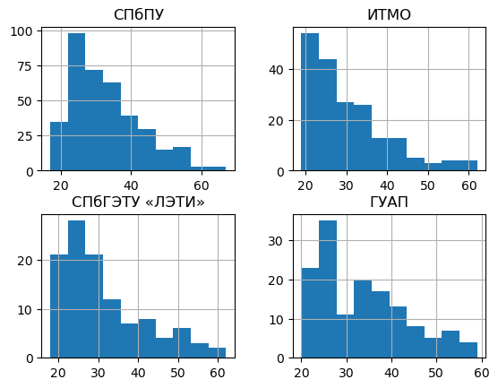

# Аналитика по резюме выпускников

## Подготовка к работе

```python showLineNumbers title="Импорты необходимых библиотек"
import os
import json
import math
import requests
import pandas as pd
from datetime import datetime
from dotenv import load_dotenv
```

Вся ниже представленная информация базируется на возможностях, предоставляемых [HeadHunter API](https://dev.hh.ru/).

:::caution Обратите внимание

Вам **потребуется аккаунт пользователя**, который идентифицируется HH как **работодатель**. Это может быть, как корпоративный аккаунт от университета (в рамках HH есть центральный HR-аккаунт, который может регистрировать новых корпоративных пользователей), так и совсем сторонний работодатель. С точки зрения забора данных это не важно. **Дополнительных финансовых вложений не потребуется**, мы будем использовать только данные резюме, которые требуют только авторизацию под аккаунтом работодателя.

:::

Дополнительно к аккаунту от работодателя Вам потребуется зарегистрировать приложение для работы с API. Авторизуйтесь (зарегистрировать приложение можно под личным аккаунтом на HH, но рекомендую, для порядка, делать это всё из под одной корпоративной учётки) в [личном кабинете разработчика](https://dev.hh.ru/admin) и зарегистрируйте новое приложение. По моему опыту процесс одобрения приложения со стороны HH не превышает одной недели.

После регистрации приложения у него появятся следующие реквизиты: `Client ID`, `Client Secret`, `Токен приложения`. Это позволит Вам авторизовать пользователя и получить реквизиты для работы с API. Сам процесс авторизации неплохо описан самим HeadHunter в [статье на Habr-е](https://habr.com/ru/companies/hh/articles/303168/). **Обратите внимание**, что токен авторизации пользователя имеет ограниченное время жизни, его придётся обновлять.

Надеюсь у Вас **всё получится**! 💪

### ID университетов в HH

Для поиска ID-шников университетов, которые мы будем использовать для работы с API, вы можете использовать 3 способа:

1. [«Ручку» API HH](https://api.hh.ru/openapi/redoc#tag/Podskazki/operation/get-educational-institutions-suggests) для поиска по учебным заведениям. Вот [пример ссылки](https://api.hh.ru/suggests/educational_institutions?text=%D0%98%D0%A2%D0%9C%D0%9E) для поиска «ИТМО»;
1. [«Ручку» API psal.ru](https://app.psal.ru/api/university/), с данными об университетах, которые отслеживаются проектом (на момент написания, апрель 2023 года, это университеты, входящие в федеральные программы «Приоритет 2030» и «Передовые инженерные школы»);
1. Ещё можно воспользоваться [расширенным поиском](https://hh.ru/search/resume/advanced) на самом hh.ru, где есть UI-ки для указания учебного заведения. Вы можете воспользоваться DevTool браузера и при поиске/выборе учебного заведения, забирать необходимое Вам ID.

Я буду использовать **вариант упомянутый в пункте 2** и для полноты картины остановлюсь на некоторых моментах:

1. У университетов есть филиалы, но в используемом API psa.ru используется только ID головных организаций. Для примера можно посмотреть [МФТИ](https://api.hh.ru/suggests/educational_institutions?text=%D0%9C%D0%A4%D0%A2%D0%98), как это бывает.
1. Данные HH, видимо, не всегда поспевают за переименованиями университетов и проходится «отлавливать» вузы по старым названиям. Из того, с чем столкнулся, при поиске ID-шников: «Уральский государственный медицинский университет» — «Уральская государственная медицинская академия»; «Смоленский государственный медицинский университет» — «Смоленская государственная медицинская академия»; «Тихоокеанский государственный медицинский университет» — «Владивостокский государственный медицинский университет».
1. Университеты объединяются, в этом случае в API psa.ru используется ID одной из объединённых организаций, если в данных HH нет ещё нового названия университета. Конкретный пример — для «Уфимский университет науки и технологий» используется «Башкирского государственного университета».
1. По каким-то причинам мне не удалось найти в HH «Университет Иннополис» 🤷‍♂️

## Исходные данные об университетах

Сформируем таблицу университетов с основными данными и ID для работы с HH API.


```python showLineNumbers title="Вспомогательная функция для работы с API https://app.psal.ru/api"
def get_results_from_api(url, page=1):
    results = pd.DataFrame()

    resp = requests.get(url + f"?page={page}")

    if resp.status_code == 200:
        json_data = resp.json()
        results = pd.concat([results, pd.json_normalize(json_data['results'])], ignore_index=True)

        if json_data['next']:
            next_page_df = get_results_from_api(url, page + 1)
            results = pd.concat([results, next_page_df], ignore_index=True)
    else:
        return pd.DataFrame()

    return results
```


```python showLineNumbers title="Формируем таблицу со списком университетов"
universities = get_results_from_api('https://app.psal.ru/api/university/')
universities = universities[universities['deleted_at'].isnull()]
universities = universities.apply(lambda x: pd.concat([
    x[list(filter(lambda y: y in ['id', 'title_short', 'title_display', 'domain', 'educational_institution_id'], x.keys()))],
    pd.Series({'educational_institution_id': x['hh'][0]['educational_institution_id']})
]), axis=1)
universities = universities[~universities['educational_institution_id'].isnull()]
universities['educational_institution_id'] = universities['educational_institution_id'].astype(int)
universities.head(5)
```


<div>
<table class="dataframe">
  <thead>
    <tr>
      <th></th>
      <th>id</th>
      <th>title_short</th>
      <th>title_display</th>
      <th>domain</th>
      <th>educational_institution_id</th>
    </tr>
  </thead>
  <tbody>
    <tr>
      <th>0</th>
      <td>1</td>
      <td>Адыгейский государственный университет</td>
      <td>АГУ</td>
      <td>adygnet.ru</td>
      <td>41900</td>
    </tr>
    <tr>
      <th>1</th>
      <td>2</td>
      <td>Алтайский государственный университет</td>
      <td>АлтГУ</td>
      <td>asu.ru</td>
      <td>41808</td>
    </tr>
    <tr>
      <th>2</th>
      <td>3</td>
      <td>Амурский государственный университет</td>
      <td>АмГУ</td>
      <td>amursu.ru</td>
      <td>42650</td>
    </tr>
    <tr>
      <th>3</th>
      <td>4</td>
      <td>Астраханский государственный университет</td>
      <td>АГУ им. В.Н. Татищева</td>
      <td>asu.edu.ru</td>
      <td>40229</td>
    </tr>
    <tr>
      <th>5</th>
      <td>6</td>
      <td>Белгородский государственный технологический у...</td>
      <td>БГТУ</td>
      <td>bstu.ru</td>
      <td>45479</td>
    </tr>
  </tbody>
</table>
</div>


## Забираем резюме из HH

Для начала настроим всё, что нам понадобится для работы с HH API.


```python showLineNumbers title="Подготовка для работы с HH API"
load_dotenv('../.env')
access_token = os.getenv('HH_ACCESS_TOKEN_USER')
session = requests.session()
session.headers.update({'Authorization': f"Bearer {os.getenv('HH_ACCESS_TOKEN_USER')}"})
# Расшифровка GET-параметров в запросе
# area - регион поиска (113 - вся Россия)
# educational_institution - id-конкретного университета
# job_search_status - кандидаты находятся в активном поиске
# relocation - живут или готовы к релокации из региона
# order_by - сортируем по ожидаемой заработной плате
# period - 1 день (ниже см. почему выбран именно такой период)
# per_page - кол-во результатов на странице ответа
# page - номер страницы в выдаче
# text - возможность поиска по текстам вакансии, но мы её игнорируем
search_query = '''
/resumes?
area=113
&educational_institution={edu_inst_id}
&job_search_status=active_search
&relocation=living_or_relocation
&order_by=salary_desc
&period=1
&per_page={per_page}
&page={page}
&text=
'''.replace('\n', '')

# Функция для работы с API HH
def get_data(edu_inst_id, page=0, per_page=100) -> list:
    url = f"https://api.hh.ru{search_query.format(edu_inst_id=edu_inst_id, per_page=per_page, page=page)}"
    resp = session.get(url)
    resumes = []

    if resp.status_code == 200:
        json_data = resp.json()
        total = json_data['found']
        count_of_page = math.ceil(total / per_page)
        resumes += json_data['items']

        if count_of_page != page + 1:
            resumes += get_data(edu_inst_id, page + 1)
    else:
        print(f'{url} returned status code {resp.status_code}')

    return resumes
```

Далее сходим в API и сохраним результаты по каждому университету в отдельный json-файл. Потребуется время, процесс можно отслеживать в папке `data/json_from_hh_api/`, куда сохраняются результирующие json-чики. В конце посмотрим ТОП-10 университетов по количеству резюме их выпускников на данный момент.


```python showLineNumbers title="Сбор резюме по университетам"
resume_by_universities = pd.DataFrame()

for i, u in universities.iterrows():
    educational_institution_id = u['educational_institution_id']
    university_title = u['title_display']
    resume_by_university = get_data(educational_institution_id)
    file_path = f"data/resume/{educational_institution_id}.json"

    with open(file_path, 'w') as f:
        json.dump(resume_by_university, f, ensure_ascii=False, indent=4)

    resume_by_universities = pd.concat([resume_by_universities, pd.DataFrame([{
        'title_display': u['title_display'],
        'educational_institution_id': educational_institution_id,
        'resume_count': len(resume_by_university),
        'file_path': file_path
    }])], ignore_index=True)

resume_by_universities.sort_values(by='resume_count', ascending=False).head(10)
```


<div>
<table class="dataframe">
  <thead>
    <tr>
      <th></th>
      <th>title_display</th>
      <th>educational_institution_id</th>
      <th>resume_count</th>
      <th>file_path</th>
    </tr>
  </thead>
  <tbody>
    <tr>
      <th>109</th>
      <td>РАНХиГС</td>
      <td>39639</td>
      <td>843</td>
      <td>data/resume/39639.json</td>
    </tr>
    <tr>
      <th>107</th>
      <td>ВШЭ</td>
      <td>39307</td>
      <td>568</td>
      <td>data/resume/39307.json</td>
    </tr>
    <tr>
      <th>43</th>
      <td>РЭУ им. Г.В. Плеханова</td>
      <td>38958</td>
      <td>563</td>
      <td>data/resume/38958.json</td>
    </tr>
    <tr>
      <th>51</th>
      <td>СПбПУ</td>
      <td>39765</td>
      <td>416</td>
      <td>data/resume/39765.json</td>
    </tr>
    <tr>
      <th>72</th>
      <td>УРФУ</td>
      <td>43473</td>
      <td>416</td>
      <td>data/resume/43473.json</td>
    </tr>
    <tr>
      <th>25</th>
      <td>МГТУ им. Н.Э. Баумана</td>
      <td>38921</td>
      <td>399</td>
      <td>data/resume/38921.json</td>
    </tr>
    <tr>
      <th>46</th>
      <td>РУДН</td>
      <td>39271</td>
      <td>387</td>
      <td>data/resume/39271.json</td>
    </tr>
    <tr>
      <th>87</th>
      <td>РУТ (МИИТ)</td>
      <td>39532</td>
      <td>337</td>
      <td>data/resume/39532.json</td>
    </tr>
    <tr>
      <th>29</th>
      <td>МПГУ</td>
      <td>39337</td>
      <td>332</td>
      <td>data/resume/39337.json</td>
    </tr>
    <tr>
      <th>81</th>
      <td>КФУ</td>
      <td>43555</td>
      <td>300</td>
      <td>data/resume/43555.json</td>
    </tr>
  </tbody>
</table>
</div>


:::caution Обратите внимание

На примере выпускников РАНХиГС мы видим, что за 1 день, API ~850 резюме. При этом у HH есть ограничение в 2 тыс. записей, который они отдают по запросу (это касается как API, так и UI-ек на их сайте). По этим причинам в данном примере и используется 1 день в GET-параметре `period`, чтобы влезть в это ограничение и ничего не упустить.

:::

## Работа с полученными данными

Теперь на нескольких примерах пробежимся по 🤩 **впечатляющему объёму данных**, который у нас получился. **Очень надеюсь**, что аналитики университетов зацепятся за эту возможность и попробуют более глубоко изучить информацию о выпускниках.

Соберём всё в один dataframe и отобразим получившееся количество строк:


```python showLineNumbers title="Сводим всё в один dataframe"
all_resume = pd.DataFrame()

for i, u in resume_by_universities.iterrows():
    json_by_university = json.load(open(u['file_path'], 'r'))
    df_by_university = pd.json_normalize(json_by_university)
    df_by_university['title_display'] = u['title_display']
    all_resume = pd.concat([all_resume, df_by_university], ignore_index=True)

len(all_resume)
```

    17144


### Заработные платы выпускников

Самое очевидное это ожидаемая **заработная плата** соискателей. Просто для примера, выстроим университеты по медиане ожидаемой заработной платы выпускников. Оговорюсь, что **реальной ценности** такого подхода «в лоб» **нет или он даже вреден**, т.к. для построения рейтинга нужно учитывать регион, область полученного образования и ещё ряд факторов. Но для обзора возможностей на полученных данных 👌


```python showLineNumbers title="Выстраиваем университеты по заработной плате"
all_resume[
    # Используем только заработные платы в рублях (лень было пересчитывать валюты 🤷‍♂️)
    (all_resume['salary.currency'] == 'RUR') &
    # Исключаем резюме без заработной платы
    (~all_resume['salary.amount'].isnull()) &
    # Смотрим только резюме с ЗП выше или равно МРОТ (на апрель 2023 г.)
    (all_resume['salary.amount'] >= 13890)
][['title_display', 'salary.amount']].groupby(by='title_display').median().sort_values(by='salary.amount', ascending=False).head(10)
```


<div>
<table class="dataframe">
  <thead>
    <tr>
      <th></th>
      <th>salary.amount</th>
    </tr>
    <tr>
      <th>title_display</th>
      <th></th>
    </tr>
  </thead>
  <tbody>
    <tr>
      <th>МФТИ</th>
      <td>150000.0</td>
    </tr>
    <tr>
      <th>МГИМО</th>
      <td>120000.0</td>
    </tr>
    <tr>
      <th>РАМ им. Гнесиных</th>
      <td>111500.0</td>
    </tr>
    <tr>
      <th>НИУ МГСУ</th>
      <td>110000.0</td>
    </tr>
    <tr>
      <th>ТГМУ</th>
      <td>110000.0</td>
    </tr>
    <tr>
      <th>УГНТУ</th>
      <td>100000.0</td>
    </tr>
    <tr>
      <th>ВШЭ</th>
      <td>100000.0</td>
    </tr>
    <tr>
      <th>МИРЭА</th>
      <td>100000.0</td>
    </tr>
    <tr>
      <th>МГТУ им. Н.Э. Баумана</th>
      <td>100000.0</td>
    </tr>
    <tr>
      <th>НИУ МЭИ</th>
      <td>100000.0</td>
    </tr>
  </tbody>
</table>
</div>


### Количество образований в резюме

Резюме отобраны по факту вхождения одного из вузов в список образовательных организаций, которые указаны в резюме, т.е. конкретный университет из нашего списка, может и бывает далеко не единственным. Это **даёт Вашим аналитикам** большое пространство для новых гипотез.

Начнём с банального рейтинга университетов по средней длине списка образовательных организаций, в которые они входят:


```python showLineNumbers title="Рейтинг университетов по средней длине списка"
all_resume['edu_count'] = all_resume['education.primary'].apply(lambda x: len(x))
all_resume[['title_display', 'edu_count']].groupby(by='title_display').mean().sort_values(by='edu_count', ascending=False).head(10)
```


<div>
<table class="dataframe">
  <thead>
    <tr>
      <th></th>
      <th>edu_count</th>
    </tr>
    <tr>
      <th>title_display</th>
      <th></th>
    </tr>
  </thead>
  <tbody>
    <tr>
      <th>ПИМУ</th>
      <td>2.555556</td>
    </tr>
    <tr>
      <th>ВМА</th>
      <td>2.500000</td>
    </tr>
    <tr>
      <th>МГМСУ</th>
      <td>2.370968</td>
    </tr>
    <tr>
      <th>РНИМУ</th>
      <td>2.362069</td>
    </tr>
    <tr>
      <th>ПСПбГМУ</th>
      <td>2.310345</td>
    </tr>
    <tr>
      <th>МГППУ</th>
      <td>2.275862</td>
    </tr>
    <tr>
      <th>РАНХиГС</th>
      <td>2.265718</td>
    </tr>
    <tr>
      <th>МГИМО</th>
      <td>2.237500</td>
    </tr>
    <tr>
      <th>БГМУ</th>
      <td>2.185185</td>
    </tr>
    <tr>
      <th>ВШЭ</th>
      <td>2.181338</td>
    </tr>
  </tbody>
</table>
</div>


### Резюме обучающихся

Данные позволяют нам отсеять из общей массы резюме обучающихся и изучить их отдельно:


```python showLineNumbers title="Отсеиваем обучающихся и выводим их количество"
all_resume['is_student'] = all_resume['education.primary'].apply(lambda x: len(x) == 1 and x[0]['year'] > datetime.now().year)
all_resume[all_resume['is_student']][['title_display', 'is_student']].groupby(by='title_display').count().sort_values(by='is_student', ascending=False).head(10)
```


<div>
<table class="dataframe">
  <thead>
    <tr>
      <th></th>
      <th>is_student</th>
    </tr>
    <tr>
      <th>title_display</th>
      <th></th>
    </tr>
  </thead>
  <tbody>
    <tr>
      <th>ВШЭ</th>
      <td>57</td>
    </tr>
    <tr>
      <th>РАНХиГС</th>
      <td>51</td>
    </tr>
    <tr>
      <th>МГТУ им. Н.Э. Баумана</th>
      <td>38</td>
    </tr>
    <tr>
      <th>СПбПУ</th>
      <td>34</td>
    </tr>
    <tr>
      <th>УРФУ</th>
      <td>32</td>
    </tr>
    <tr>
      <th>КФУ</th>
      <td>31</td>
    </tr>
    <tr>
      <th>РУДН</th>
      <td>28</td>
    </tr>
    <tr>
      <th>ИТМО</th>
      <td>24</td>
    </tr>
    <tr>
      <th>РУТ (МИИТ)</th>
      <td>22</td>
    </tr>
    <tr>
      <th>СПбГУПТД</th>
      <td>21</td>
    </tr>
  </tbody>
</table>
</div>


### Какую работу ищут выпускники

В данных присутствует желаемое кандидатом название должности. Попробуем сгруппировать данные для одного из университетов и посмотрим ТОП 10 самых популярных должностей.


```python showLineNumbers title="Группируем данные по названию должности"
resume_by_etu = all_resume[all_resume['title_display'] == 'СПбГЭТУ «ЛЭТИ»'][['title_display', 'title', 'url']]
resume_by_etu_and_title = resume_by_etu.groupby(by=['title_display', 'title'], as_index=False).count().rename(columns={'url': 'count'}).sort_values(by='count', ascending=False)
resume_by_etu_and_title.head(10)
```


<div>
<table class="dataframe">
  <thead>
    <tr>
      <th></th>
      <th>title_display</th>
      <th>title</th>
      <th>count</th>
    </tr>
  </thead>
  <tbody>
    <tr>
      <th>13</th>
      <td>СПбГЭТУ «ЛЭТИ»</td>
      <td>Frontend-разработчик</td>
      <td>4</td>
    </tr>
    <tr>
      <th>109</th>
      <td>СПбГЭТУ «ЛЭТИ»</td>
      <td>Руководитель отдела продаж</td>
      <td>2</td>
    </tr>
    <tr>
      <th>91</th>
      <td>СПбГЭТУ «ЛЭТИ»</td>
      <td>Менеджер проекта</td>
      <td>2</td>
    </tr>
    <tr>
      <th>38</th>
      <td>СПбГЭТУ «ЛЭТИ»</td>
      <td>Python Developer</td>
      <td>2</td>
    </tr>
    <tr>
      <th>69</th>
      <td>СПбГЭТУ «ЛЭТИ»</td>
      <td>Инженер</td>
      <td>2</td>
    </tr>
    <tr>
      <th>98</th>
      <td>СПбГЭТУ «ЛЭТИ»</td>
      <td>Начинающий специалист</td>
      <td>2</td>
    </tr>
    <tr>
      <th>28</th>
      <td>СПбГЭТУ «ЛЭТИ»</td>
      <td>Junior Python Developer</td>
      <td>2</td>
    </tr>
    <tr>
      <th>8</th>
      <td>СПбГЭТУ «ЛЭТИ»</td>
      <td>Data scientist</td>
      <td>2</td>
    </tr>
    <tr>
      <th>82</th>
      <td>СПбГЭТУ «ЛЭТИ»</td>
      <td>Копирайтер</td>
      <td>1</td>
    </tr>
    <tr>
      <th>83</th>
      <td>СПбГЭТУ «ЛЭТИ»</td>
      <td>Куратор, копирайтер</td>
      <td>1</td>
    </tr>
  </tbody>
</table>
</div>


И взглянем на конец списка, чтобы зафиксировать одну из проблем в данных.


```python showLineNumbers title="Конец сгрупированного списка по названию должности"
resume_by_etu_and_title.tail(10)
```


<div>
<table class="dataframe">
  <thead>
    <tr>
      <th></th>
      <th>title_display</th>
      <th>title</th>
      <th>count</th>
    </tr>
  </thead>
  <tbody>
    <tr>
      <th>45</th>
      <td>СПбГЭТУ «ЛЭТИ»</td>
      <td>Sales</td>
      <td>1</td>
    </tr>
    <tr>
      <th>44</th>
      <td>СПбГЭТУ «ЛЭТИ»</td>
      <td>QA инженер</td>
      <td>1</td>
    </tr>
    <tr>
      <th>43</th>
      <td>СПбГЭТУ «ЛЭТИ»</td>
      <td>QA engineer</td>
      <td>1</td>
    </tr>
    <tr>
      <th>42</th>
      <td>СПбГЭТУ «ЛЭТИ»</td>
      <td>QA Engineer (Junior)</td>
      <td>1</td>
    </tr>
    <tr>
      <th>41</th>
      <td>СПбГЭТУ «ЛЭТИ»</td>
      <td>QA Engineer</td>
      <td>1</td>
    </tr>
    <tr>
      <th>40</th>
      <td>СПбГЭТУ «ЛЭТИ»</td>
      <td>Python developer</td>
      <td>1</td>
    </tr>
    <tr>
      <th>39</th>
      <td>СПбГЭТУ «ЛЭТИ»</td>
      <td>Python backend разработчик</td>
      <td>1</td>
    </tr>
    <tr>
      <th>37</th>
      <td>СПбГЭТУ «ЛЭТИ»</td>
      <td>Project Manager</td>
      <td>1</td>
    </tr>
    <tr>
      <th>36</th>
      <td>СПбГЭТУ «ЛЭТИ»</td>
      <td>Product manager</td>
      <td>1</td>
    </tr>
    <tr>
      <th>124</th>
      <td>СПбГЭТУ «ЛЭТИ»</td>
      <td>руководитель, инженер по КИПиА</td>
      <td>1</td>
    </tr>
  </tbody>
</table>
</div>


Из-за того что название — текстовое поле. кандидаты указывают там слишком уникальные значения. Нужно что-то более нормализированное для анализа. Для этого придётся сходить в каждую вакансию и получить более [подробную информацию по резюме](https://api.hh.ru/openapi/redoc#tag/Vakansii/operation/get-vacancy). **Обратите внимание**, что API отдаёт более расширенную информацию.

```python showLineNumbers title="Получаем подробную информацию из резюме"
json_with_full_info_by_etu = []

# Тут мы упираемся видимо в бесплатные возможности API, которое отдаёт подробную информацию только по 50 резюме
for i, r in resume_by_etu[:50].iterrows():
    resp_full_info = session.get(r['url'])

    if resp_full_info.status_code == 200:
        json_with_full_info_by_etu.append(resp_full_info.json())

resume_full_by_etu = pd.json_normalize(json_with_full_info_by_etu)
resume_full_by_etu[['title', 'professional_roles']].head(10)
```


<div>
<table class="dataframe">
  <thead>
    <tr>
      <th></th>
      <th>title</th>
      <th>professional_roles</th>
    </tr>
  </thead>
  <tbody>
    <tr>
      <th>0</th>
      <td>DevOps engineer / SRE</td>
      <td>&#91;&#123;'id': '96', 'name': 'Программист, разработчи...</td>
    </tr>
    <tr>
      <th>1</th>
      <td>(Ведущий) Менеджер по продукту, Менеджер проектов</td>
      <td>&#91;&#123;'id': '10', 'name': 'Аналитик'&#125;, &#123;'id': '73'...</td>
    </tr>
    <tr>
      <th>2</th>
      <td>Менеджер проекта</td>
      <td>&#91;&#123;'id': '104', 'name': 'Руководитель группы ра...</td>
    </tr>
    <tr>
      <th>3</th>
      <td>Руководитель отдела разработки</td>
      <td>&#91;&#123;'id': '107', 'name': 'Руководитель проектов'...</td>
    </tr>
    <tr>
      <th>4</th>
      <td>Начальник отдела, начальник сектора</td>
      <td>&#91;&#123;'id': '16', 'name': 'Аудитор'&#125;&#93;</td>
    </tr>
    <tr>
      <th>5</th>
      <td>Электрик</td>
      <td>&#91;&#123;'id': '40', 'name': 'Другое'&#125;, &#123;'id': '143',...</td>
    </tr>
    <tr>
      <th>6</th>
      <td>QA инженер</td>
      <td>&#91;&#123;'id': '124', 'name': 'Тестировщик'&#125;&#93;</td>
    </tr>
    <tr>
      <th>7</th>
      <td>Product manager</td>
      <td>&#91;&#123;'id': '107', 'name': 'Руководитель проектов'...</td>
    </tr>
    <tr>
      <th>8</th>
      <td>Java developer</td>
      <td>&#91;&#123;'id': '96', 'name': 'Программист, разработчи...</td>
    </tr>
    <tr>
      <th>9</th>
      <td>Преподаватель английского языка (Native)</td>
      <td>&#91;&#123;'id': '132', 'name': 'Teacher, educator'&#125;, &#123;...</td>
    </tr>
  </tbody>
</table>
</div>


:::danger Возможен неожиданный эффект

После написании данного материала и сбора данных (в качестве аккаунта работодателя использовался аккаунт моего ИП), мне в Телеграм написал человек, с просьбой рассмотреть его кандидатуру, т.к. я **просматривал его резюме**. При этом, я пользовался как API, так и обычными UI-ками HH для работодателей (второе использовалось для дебага кода).

Что конкретно сгенерировало уведомление соискателю о просмотре его резюме моим ИП (API или UI-ки HH) я не стал выяснять 🤷‍♂️, но стоит **помнить о таком возможном эффекте** при работе с API HH.

:::


Ели нет возможности расшить деньгами ограничение в 50 вакансий с подробной информацией... есть обходной, запасной вариант, которым часто приходится пользоваться, работая с HH 👍. Для этого придётся сначала сформировать справочник по имеющимся [профессиональным ролям](https://github.com/hhru/api/blob/master/docs/role_catalog_article.md) и при начальном сборе информации по университетам обходить API по каждой профессиональной роли указывая её в GET параметре `professional_role`.

### Банальные цифры

В данных указан пол. Можно взглянуть на эти данные по конкретному университету:


```python showLineNumbers title="Сводная таблица по полу"
pd.pivot_table(
    all_resume[['title_display', 'gender.id', 'id']],
    index='title_display',
    columns='gender.id',
    values='id',
    aggfunc='count',
).sort_values(by='male', ascending=False).head(10)
```


<div>
<table class="dataframe">
  <thead>
    <tr>
      <th>gender.id</th>
      <th>female</th>
      <th>male</th>
    </tr>
    <tr>
      <th>title_display</th>
      <th></th>
      <th></th>
    </tr>
  </thead>
  <tbody>
    <tr>
      <th>РАНХиГС</th>
      <td>360.0</td>
      <td>483.0</td>
    </tr>
    <tr>
      <th>МГТУ им. Н.Э. Баумана</th>
      <td>86.0</td>
      <td>313.0</td>
    </tr>
    <tr>
      <th>РЭУ им. Г.В. Плеханова</th>
      <td>280.0</td>
      <td>283.0</td>
    </tr>
    <tr>
      <th>СПбПУ</th>
      <td>147.0</td>
      <td>269.0</td>
    </tr>
    <tr>
      <th>ВШЭ</th>
      <td>306.0</td>
      <td>262.0</td>
    </tr>
    <tr>
      <th>УРФУ</th>
      <td>166.0</td>
      <td>250.0</td>
    </tr>
    <tr>
      <th>РУТ (МИИТ)</th>
      <td>122.0</td>
      <td>215.0</td>
    </tr>
    <tr>
      <th>УГНТУ</th>
      <td>55.0</td>
      <td>209.0</td>
    </tr>
    <tr>
      <th>МАИ</th>
      <td>69.0</td>
      <td>197.0</td>
    </tr>
    <tr>
      <th>НИУ МГСУ</th>
      <td>50.0</td>
      <td>180.0</td>
    </tr>
  </tbody>
</table>
</div>


Можно посмотреть распределение по возрасту для конкретных университетов:


```python showLineNumbers title="Смотрим распределение по возрасту в 4-х университетах"
pd.DataFrame({
    'СПбПУ': all_resume[(all_resume['title_display'] == 'СПбПУ') & (~all_resume['age'].isnull())]['age'],
    'ИТМО': all_resume[(all_resume['title_display'] == 'ИТМО') & (~all_resume['age'].isnull())]['age'],
    'СПбГЭТУ «ЛЭТИ»': all_resume[(all_resume['title_display'] == 'СПбГЭТУ «ЛЭТИ»') & (~all_resume['age'].isnull())]['age'],
    'ГУАП': all_resume[(all_resume['title_display'] == 'ГУАП') & (~all_resume['age'].isnull())]['age']
}).hist(bins=10)
```

    

    


### Где выпускники учатся после

В завершении посмотрим что-то более сложное и менее очевидное. Данные об образовании позволяют **изучить последовательность получения образования**. На этой базе можно попробовать сделать какие-нибудь, не на столько очевидные выводы. Посмотрим, где получают последующее образования выпускники одного из университетов.


```python showLineNumbers title="Смотрим где учатся выпускники РАНХиГС"
universities_by_id = universities.set_index('educational_institution_id')
university_for_research = universities[universities['title_display'] == 'РАНХиГС'].iloc[0].T
next_edu = pd.DataFrame()

for i, r in all_resume[all_resume['title_display'] == university_for_research['title_display']].iterrows():
    is_completed_edu = False

    for edu in r['education.primary']:
        if edu['name_id'] == str(university_for_research['educational_institution_id']) and edu['year'] <= datetime.now().year:
            is_completed_edu = True
        elif is_completed_edu and edu['name_id'] != str(university_for_research['educational_institution_id']):
            next_edu = pd.concat([next_edu, pd.DataFrame([{
                'next_edu_id': edu['name_id'],
                'next_edu_title': edu['name']
            }])])

next_edu.groupby(by='next_edu_title', as_index=False).count().rename(columns={'next_edu_id': 'count'}).sort_values(by='count', ascending=False).head(10)
```


<div>
<table class="dataframe">
  <thead>
    <tr>
      <th></th>
      <th>next_edu_title</th>
      <th>count</th>
    </tr>
  </thead>
  <tbody>
    <tr>
      <th>276</th>
      <td>Национальный исследовательский университет "Вы...</td>
      <td>10</td>
    </tr>
    <tr>
      <th>351</th>
      <td>Российский экономический университет им. Г.В. ...</td>
      <td>10</td>
    </tr>
    <tr>
      <th>241</th>
      <td>Московский государственный университет им. М.В...</td>
      <td>9</td>
    </tr>
    <tr>
      <th>342</th>
      <td>Российский государственный университет нефти и...</td>
      <td>8</td>
    </tr>
    <tr>
      <th>238</th>
      <td>Московский государственный технологический уни...</td>
      <td>8</td>
    </tr>
    <tr>
      <th>235</th>
      <td>Московский государственный технический универс...</td>
      <td>7</td>
    </tr>
    <tr>
      <th>468</th>
      <td>Финансовый университет при Правительстве Росси...</td>
      <td>7</td>
    </tr>
    <tr>
      <th>200</th>
      <td>Московская Государственная юридическая академи...</td>
      <td>7</td>
    </tr>
    <tr>
      <th>348</th>
      <td>Российский университет дружбы народов, Москва</td>
      <td>6</td>
    </tr>
    <tr>
      <th>225</th>
      <td>Московский государственный горный университет,...</td>
      <td>6</td>
    </tr>
  </tbody>
</table>
</div>


## Вместо выводов

**Очень надеюсь**, что мне удалось продемонстрировать, в первом приближении, возможности данных, которые вы можете самостоятельно получить из API HH. Мне кажется, что **анализ своих выпускников**, опирающийся на объективные данные, должен быть одной из **основных задач**, стоящих перед аналитическими подразделениями внутри университетов. А после отработки инструментария можно пробовать выходить на региональный или федеральный уровень.

Объём данных такой, что у меня нет технической возможности постоянно забирать их и строить Dashboard-ы на основании полученного, по аналогии с 📊 [вакансиями университетов](https://datalens.yandex/qv1g5xwqyzysg) 🤷‍♂️

Исходный Jupiter Notebook для данной страницы находится по [ссылке в Github](https://github.com/psalru/analytics/blob/master/PSAL-17_data_from_hh/resume.ipynb) Получившийся набор данных, на момент написания этого материала, вы можете ⬇️ скачать по [ссылке](https://storage.yandexcloud.net/psal.public/datasets/2023-04-30-resume_by_universities.zip).


