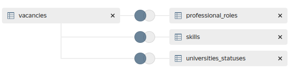
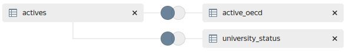

# Примеры дашбордов на Datalens

На данной странице описаны примеры дашбордов, которые реализованы в рамках проекта с использованием [Datalens](https://cloud.yandex.ru/services/datalens) (облачная версия). Несмотря на то, что данные, которые используются для визуализации постоянно пополняются (в тексте присутствуют ссылки на код) и я стараюсь следить за их корректностью, реализованное скорей **попытка показать один из вариантов «как можно»** и побудить/вдохновить Вас попробовать сделать что-то похожее у себя в университете.

:::caution Выборка университетов

Для всех дашбордов, когда речь идёт об университетах, в выборку включаются университеты, участники федеральных программ [«Приоритет 2030»](https://priority2030.ru/) и [«Передовые инженерные школы»](https://engineers2030.ru/) (если я успел/не поленился всё актуализировать 🥴).

:::

Для тех, кому нужны обучающие материалы, а **не примеры чего-то** готового:

1. Бесплатный [курс по Datalens](https://cloud.yandex.ru/training/datalens)
1. Ежегодно проводится [DataLens Festival](https://cloud.yandex.ru/datalens-festival) (см. архивы материалов)
1. В официальной [группе Datalens в Телеграм](https://t.me/YandexDataLens) можно задать вопрос сообществу

## Вакансии университетов

В 📊 [дашборде]((https://datalens.yandex/qv1g5xwqyzysg)) используются данные [портала HH](https://hh.ru/), который является если не самым популярным ресурсом по поиску работы в 🇷🇺 России, то точно входит в **очень короткий список лидеров**. Данные **с марта 2023 года** собираются раз в неделю с помощью Apache Airflow (подробнее об этом DAG-е читайте по [ссылке](/docs/tools/airflow#dag-собирающий-вакансии-университетов)).

В данный момент дашборд разбит на 3 вкладки:

1. 📊 [Аналитика по вакансиям](https://datalens.yandex/qv1g5xwqyzysg?tab=mP) — вкладка с **общей аналитикой** по всему массиву собираемых вакансий университетов;
1. 🔍 [Поиск по вакансиям](https://datalens.yandex.ru/qv1g5xwqyzysg-vakansii-universitetov-rf?tab=R2) — данная вкладка скорей **ориентированна на соискателей**, в которой относительно удобно можно фильтровать вакансии по параметрам и повыбирать для себя что-то интересное;
1. 📑 [Отчёты по университетам](https://datalens.yandex.ru/qv1g5xwqyzysg-vakansii-universitetov-rf?tab=dw) — данная вкладка создавалась для того, чтобы продемонстрировать связку возможностей Datalens и [облачных функций](https://cloud.yandex.ru/services/functions) для относительно дешёвого способа **генерации отчётов**.

### Модель данных по вакансиям

Так выглядит сборка датасета непосредственно в Datalens (объединение происходит по полю `vac_id` и `u_id`):



Данный запрос формирует таблицу `vacancies`, уникализируя записи и отбирая самые последние:

```sql showLineNumbers title="Таблица с вакансиями университетов"
select distinct on (hh_id)
    hv.deleted_at            as vac_deleted_at,
    hv.id                    as vac_id,
    hv.hh_initial_created_at as vac_create_at,
    hv.title                 as vac_title,
    hv.salary_from           as vac_salary_from,
    hv.salary_to             as vac_salary_to,
    hv.salary_gross          as vac_salary_gross,
    hv.experience            as vac_experience,
    hv.schedule              as vac_schedule,
    hv.employment            as vac_employment,
    hv.url                   as vac_url,
    gfr.title                as vac_region,
    uu.id                    as u_id,
    uu.geo_point             as u_geo_point,
    uu.title_short           as u_title_short,
    uu.title_display         as u_title_display,
    uu.domain                as u_domain
from hh_vacancy hv
left join hh_hh_university hhu on hhu.id = hv.hh_university_id
left join university_university uu on uu.id = hhu.university_id
left join geo_federal_region gfr on gfr.id = hv.federal_region_id
where uu.deleted_at is null and hhu.deleted_at is null
order by hh_id, hv.created_at desc
```

Этот запрос формирует таблицу `professional_roles`:

```sql showLineNumbers title="Таблица с профессиональными ролями вакансий"
select
    hpr.vacancy_id as vac_id,
    hpr.title as professional_role_title
from hh_professional_role hpr
where
    hpr.vacancy_id in (select distinct on (hv.hh_id) hv.id from hh_vacancy hv order by hv.hh_id, hv.created_at desc) and
    hpr.deleted_at is null
```

Этот запрос формирует таблицу `skills`:

```sql showLineNumbers title="Таблица с требуемыми навыками"
select
    hs.vacancy_id as vac_id,
    hs.title as skill_title
from hh_skill hs
where
    hs.vacancy_id in (select distinct on (hv.hh_id) hv.id from hh_vacancy hv order by hv.hh_id, hv.created_at desc) and
    hs.deleted_at is null
```

Этот запрос формирует таблицу `universities_statuses`:

```sql showLineNumbers title="Таблица с текущими статусами университетов"
select
    uus.university_id as u_id,
    us.title as status_title
from university_university_status uus
join university_status us on us.id = uus.status_id
```

На выходе [получился](https://datalens.yandex/qv1g5xwqyzysg) довольно **практичный в использовании инструмент** 🤗, который, если расширить до всех университетов, возможно мог бы заменить «очень удобный» ресурс [ученые-исследователи.рф](https://xn----8sbfhdabdwf1afqu5baxe0f2d.xn--p1ai/), эффективность которого, на мой взгляд, **стремится к нулю** (лично мне даже жалко электричества, которое тратится на его работу 😔).

## Конверсия НИОКТР в РИДы и диссертации

Идея данного 📊 [дашборда](https://datalens.yandex/l4s0fnxnl1oib) состоит в том, чтобы посмотреть как выполняемые университетом **НИОКТР коррелируют** по количеству и пересекаются по тематикам (используется международный классификатор OECD) **c РИД-ами и диссертациями** университетов. Забором данных из  [ЕГИСУ НИОКТР](https://rosrid.ru/) занимается DAG, про который можно почитать по [ссылке](/docs/tools/airflow#dag-собирающий-ниоктр-рид-и-диссертации).

### Модель данных на базе ЕГИСУ НИОКТР

Окончательный датасет формируется в Datalens (объединение происходит по полю `active_id` и `university_id`):



Вот такой запрос формирует таблицу `actives`:

```sql showLineNumbers title="Таблица с активами (НИОКТР, РИД и диссертации) университетов"
select
    ra.id as active_id,
    ra.object_id as object_id,
    date_trunc('month', ra.date)::date as date,
    rat.title_short as type,
    ra.title,
    uu.id as university_id,
    uu.title_display as university,
    uu.title as university_full,
    gfd.title as federal_district,
    gfr.title as region,
    ra.url,
    ra.s3_bucket,
    ra.s3_key
from rosrid_active ra
join rosrid_active_type rat on rat.id = ra.type_id
join rosrid_rosrid_university rru on rru.id = ra.rosrid_university_id
join university_university uu on uu.id = rru.university_id
join geo_city gc on gc.id = uu.city_id
join geo_federal_district gfd on gfd.id = gc.federal_district_id
join geo_federal_region gfr on gfr.id = gc.federal_region_id
where
    -- Актив не удалён
    ra.deleted_at is null and
    -- Университет не удалён
    uu.deleted_at is null and
    -- Актив реально университета
    ra.is_executor
order by ra.date
```

Запрос формирующий таблицу `active_oecd`:

```sql showLineNumbers title="Таблица с OECD классификаторами активов"
select
    rao.active_id,
    concat('0', dog.code, ' - ', dog.title) oecd
from rosrid_active_oecd rao
join rosrid_active ra on ra.id = rao.active_id
join dict_oecd d on d.id = rao.oecd_id
join dict_oecd_group dog on dog.id = d.oecd_group_id
where ra.deleted_at is null
group by active_id, oecd
```

Запрос формирующий таблицу `university_status`:

```sql showLineNumbers title="Таблица с текущими статусами университетов"
select
    uus.university_id,
    us.title as university_status
from university_university_status uus
join university_status us on us.id = uus.status_id
join university_university uu on uu.id = uus.university_id
where uu.deleted_at is null
```

Сама идея [дашборда](https://datalens.yandex/l4s0fnxnl1oib) мне до сих пор нравится, но она **не до конца отражает объективную картину**, т. к. [ЕГИСУ НИОКТР](https://rosrid.ru/), на сколько я понимаю, содержит далеко не все данные касающиеся НИОКТР университетов, а лишь ту часть, которая непосредственно связана с государственным финансированием. С коллегами из [Интеграции](https://integration.institute/) мы считаем, что без лишних оговорок можно использовать только **данные про диссертации** организаций 👍

## Отслеживание публикаций в интернете

У Google существует сервис [Google Alerts](https://www.google.com/alerts), который позволяет подписаться по ключевым словам (в моём случае это _«приоритет 2030»_, _«программа стратегического академического лидерства»_, _«priority 2030»_ и _«передовые инженерные школы»_) на новые материалы появляющиеся в интернете. Эксплуатируя эту возможность родилась идея данного 📊 [дашборда](https://datalens.yandex/yogp2fsiiqh4o), которая состоит в том, что бы организовать на базе этого **бесплатного сервиса** что-то вроде «мониторинга бренда для бедных» 👌 Про DAG собирающий данные можно почитать по [ссылке](/docs/tools/airflow#dag-работающий-с-google-alerts).

### Модель данных про публикации

Для данного дашборда мы обходимся всего одной таблицей `newsfeed`:

```sql showLineNumbers title="Таблица с публикацимия"
select 
    id,
    created_at,
    updated_at,
    deleted_at,
    hash,
    topic,
    keyword,
    date,
    domain,
    url,
    title,
    content,
    s3_bucket,
    s3_key,
    row_number() over (partition by url) as number 
from google_alerts_newsfeed
where deleted_at is null order by id
```

С учётом того, что Google Alert бесплатный, **всё отлично** 👍 Но если хочется большей точности, тут возникают проблемы:

1. Сервис относительно частно присылает ложноположительные публикации, которые приходится вычищать руками.
1. Сервис ищет только на сайтах, упуская большую часть публикаций в социальных сетях и мессенджерах.

Если хочется **всё «по взрослому»**, см. в сторону таких сервисов как [brand analytics](https://brandanalytics.ru/).
